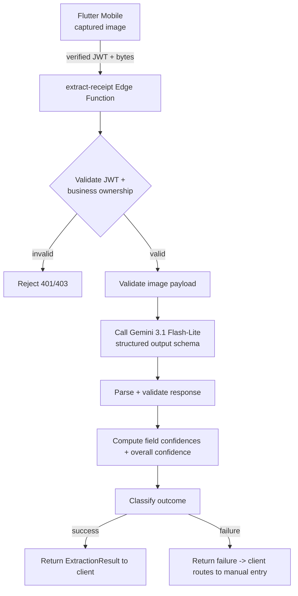
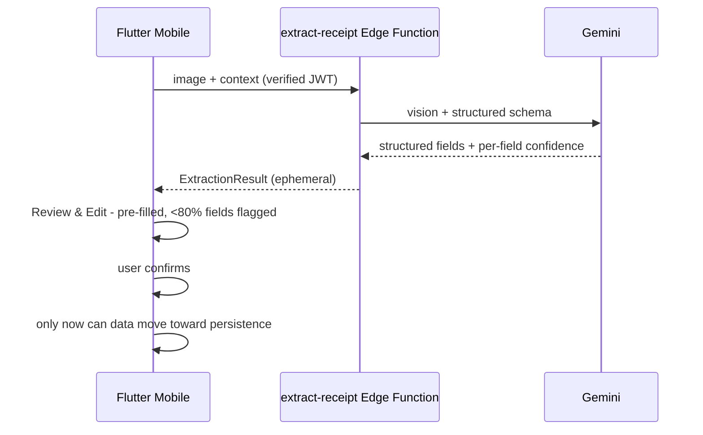

# AI Architecture

## 1. Purpose

This document defines the architecture of the AI-driven receipt/invoice data extraction subsystem: how a captured receipt becomes structured, confidence-flagged fields for the user to review, without ever persisting anything automatically.

It is the design for the **server-side AI boundary** (`extract-receipt` Edge Function) and its contract with the Flutter mobile app. The web dashboard has no AI surface (BR-WEB-005).

## 2. AI Responsibilities

1. Receive a receipt image from an authenticated, verified caller.
2. Call Gemini (model: **Gemini 3.1 Flash-Lite** — Q-007) to extract structured fields: date, total amount, vendor/customer name (if present), line items (if legible), suggested category (FR-AI-002).
3. Produce a per-field confidence and an overall confidence (FR-AI-003).
4. Classify the outcome (success / extraction failure) according to the approved rules (Q-008).
5. Return a structured result to the client. **It never writes to the database or Storage** (NFR-DATA-001).
6. Contain and protect the Gemini API key (Q-007, BR-AI-005).

## 3. MVP Scope

In scope:

- Single extraction model call per captured receipt (Gemini 3.1 Flash-Lite).
- Structured JSON extraction with field-level confidence.
- Failure classification and feedback to the client.
- Server-side secret handling.

Out of scope (documented, not built — Phase 2/3 wherever noted):

- No second model/provider fallback (Q-007 fixes the model; no inventing fallback behavior).
- No on-device AI, no OCR training, no fine-tuning, no retrieval/augmentation.
- No persistence, caching, or storage of receipt images or results by the AI layer.
- No AI-powered summaries (plain-language monthly summary is Phase 3).
- No duplicate-receipt detection (POST-MVP).
- No AI on the web dashboard (mobile-only, BR-WEB-005).

## 4. Input

The `extract-receipt` Edge Function receives from the mobile client:

- authenticated user session (JWT — `verify_jwt = true`);
- the receipt image bytes (multipart upload; client compresses/downscales for latency while preserving legibility, NFR-PERF-001);
- transaction context: type (sale/income | purchase/expense) and business identifier/context used to bias the category suggestion.

The AI layer does **not** accept any field the user has not yet reviewed, and it receives **no** persisted document reference (nothing is stored pre-confirmation).

## 5. Processing Pipeline



1. Caller validation (authentication + ownership).
2. Payload validation (image present, sane size/mime).
3. Prompt + structured schema sent to Gemini 3.1 Flash-Lite.
4. Parse the structured response strictly (schema-validated).
5. Compute/attach per-field confidence and overall confidence.
6. Classify outcome.
7. Return to client (ephemeral — nothing persisted).

## 6. Gemini Integration

- **Boundary**: the Edge Function is the only component that talks to Gemini (Q-007, ADR-004).
- **Model**: Gemini 3.1 Flash-Lite (initial production model; selected for image understanding, structured extraction, low latency, and cost — Q-007).
- **Access**: the Gemini API key is stored in the function's environment and is never embedded in, or returned to, either client (BR-AI-005).
- **Interface stability**: the function exposes one stable HTTP contract to the mobile app; the Gemini call is isolated behind it so the model/endpoint can be changed, tuned, or (post-MVP) augmented without client changes (ADR-004).
- **Call shape**: a single vision request with the receipt image inline, the transaction type, and the business category list, prompting structured JSON output.

## 7. Structured Extraction

Schema (high-level; exact fields finalized in the AI implementation phase):

- `transaction_date` — the receipt date.
- `total_amount` — the total (numeric).
- `party_name` — vendor (purchase) or customer (sale) name, if present.
- `line_items[]` — optional items: description + amount, when legible (FR-AI-002).
- `suggested_category` — the AI category suggestion from the owner's category list (FR-CATEGORY-002).
- per-field `confidence` (0–1).
- `overall_confidence` (0–1).
- Whether required information (date, amount) was found.

`party_name` and `line_items` are optional by requirement ("if present", "if legible") (FR-AI-002). The **required** fields are date and total amount — their absence is grounds for extraction failure (Q-008).

## 8. Confidence Model

- Each extracted field carries a **field confidence** on a 0–1 scale (a normalized 0–100%). The only thresholds the requirements define are applied as-is (Q-008):
  - **field confidence < 80% → flag the field for review** (FR-AI-004, BR-AI-002);
  - **overall confidence < 50% → extraction failure** (FR-AI-006, BR-AI-003).
- `overall_confidence` is derived per the approved decision (Q-008). The MVP applies a single, consistent derivation (e.g., the minimum of the required fields' confidences for the overall gate and an aggregate for display), kept as simple as the requirements allow. **No second confidence algorithm is invented** (per the phase instruction).
- Confidence is advisory: a flagged field remains editable (BR-AI-002); AI confidence never bypasses the user confirmation step (Q-008).
- The model asks Gemini to emit its own per-field confidence; the boundary normalizes and validates the values to the 0–1 scale.

## 9. Validation

- **Server-side**: schema validation of the Gemini response; numeric/format sanity checks (amount parses as a number, date parses, confidence in range); enforcement of the failure rules (required info present; overall confidence ≥ 50%).
- **Client-side**: the mobile app validates the result shape before pre-filling the Review & Edit form and mirrors the <80% flagging for display (FR-AI-004) and the failure routing (FR-AI-006).
- The AI layer treats Gemini output as untrusted data: it is validated like any external input and never written directly to persistence.

## 10. Low Confidence Handling

- Fields with confidence **< 80%** are returned flagged and rendered with a subtle highlight on the Review & Edit screen, prompting the user to double-check (FR-AI-004, BR-AI-002, AC-AI-002).
- All fields remain editable (BR-AI-002).
- If the overall result is unusable (see §5 classification and Q-008), the client routes to manual entry rather than presenting garbage data (FR-AI-006, AC-AI-006).

## 11. Extraction Failure

Extraction is **unsuccessful** when (Q-008, BR-AI-003):

```text
required information is missing
OR
overall extraction confidence < 50%
```

On failure the client:

- does not pre-fill garbage data;
- routes the user to the manual-entry form ("Enter manually instead") (FR-AI-005/008);
- never shows a hard error or a frozen screen (FR-AI-007).

Non-receipt images (empty/near-empty result) follow the same path with the copy "Couldn't read this as a receipt, try again or enter manually" (FR-AI-009, AC-AI-005).

## 12. Timeout Handling

- **Client-visible timeout: 15 seconds** (Q-009). If extraction has not produced a usable result within 15 seconds, the mobile app shows the timeout message and offers manual entry (FR-AI-008, AC-AI-004).
- This is a UX ceiling distinct from infrastructure/network timeouts (Q-009). The client owns the 15-second countdown so the user is never trapped in a loading state (NFR-PERF-001).
- The server function has its own internal timeout/error behavior (returning a structured failure) so the client's 15-second window and the server's response remain consistent; implementation details are set in the AI phase.

## 13. Manual Entry Fallback

- Manual entry is **always an option**: at the Capture screen ("Skip — enter manually", bypassing AI entirely — FR-CAPTURE-007, BR-REC-002), and as the recovery path for every AI failure/timeout/non-receipt outcome (FR-AI-005/008/009).
- Manual entry produces an empty form (FR-CAPTURE-007) and requires the same user confirmation before persistence (BR-CONFIRM-001).
- The architecture guarantees there is **no dead end** at any point in the extraction lifecycle.

## 14. User Review Boundary



- The Review & Edit screen sits **between** extraction and persistence (FR-REVIEW-001/002).
- The extraction result lives only in the client's transient state (and inside the transient server response). It is never silently written (NFR-DATA-001, BR-AI-001).
- Editing any field is allowed (FR-REVIEW-003); the user's edited values, not raw AI values, are what the confirm step persists.

## 15. Persistence Boundary

- The AI layer **does not persist** and has **no write** capability to business tables or Storage (ADR-004).
- Persistence happens only after user confirmation, via the mobile app's normal session-scoped path (image upload + transaction insert) (BR-CONFIRM-001, NFR-DATA-001).
- Even the receipt **image** is not stored before confirmation; the AI layer processes bytes in-memory. This keeps the "no silent save" guarantee literal and avoids orphaned objects (see `system-architecture.md` §9.7, `mobile-architecture.md` §12).
- The AI boundary's ownership check ensures a confirmed persistence uses the same owner context as the extraction.

## 16. Security

- Gemini key server-side only (Q-007, BR-AI-005); never shipped to, or returned by, clients.
- `verify_jwt = true` on the function; the caller must be authenticated.
- Business-ownership validation before invoking Gemini (prevents cross-tenant use and cost abuse).
- Image bytes are handled in-memory only; no receipt data written to logs.
- No secrets in responses; no storage paths or business data echoed into error bodies.
- The function holds no authority over business data (no DB/storage client keyed for writes).

## 17. Privacy

- Receipt images may contain personal data (party names, addresses, phone numbers). Privacy controls:
  - not persisted by the AI layer;
  - transmitted over TLS;
  - retained in Gemini processing only transiently (in-scope for the extraction call per provider terms);
  - confirmation-gated persistence keeps the stored thumbnails minimal and private-bucket-scoped (NFR-SEC-002);
  - the client compresses images, which also reduces data footprint;
  - deletion of a transaction deletes its image (FR-TRANS-013).
- No AI-side telemetry of receipt content; logging is limited to non-content metadata (outcome, latency, error class).

## 18. Performance

- Target "a few seconds" for extraction (NFR-PERF-001).
- Client compresses/downscales the image before the call to cut upload and inference latency while keeping it legible.
- One model call per receipt; no retry loops inside the function in MVP (the client's 15-second ceiling governs) — Q-009.
- The function is stateless, so it scales horizontally on the edge platform without design change.

## 19. Reliability

- Structured failure responses (never silent hangs or raw provider errors leaking to the user).
- The client always has the manual-entry escape (FR-AI-005/008, AC-AI-004/006).
- 15-second client ceiling prevents infinite loading regardless of provider behavior (Q-009, FR-AI-007).
- Provider outages present as failure → manual entry; the user is never blocked from recording a transaction.
- (No automatic retry/fallback model — deliberately not invented; a provider/fallback policy is a Phase 2 decision if real usage requires it.)

## 20. Observability

- Function-level metrics: request count, outcome (success/failure/low-confidence), latency, error class, bytes processed, per-business volume (non-content).
- No receipt contents, no field values, no business names in logs.
- Client-side trace: extraction duration vs the 15-second budget; flag-ratio per field (a proxy for extraction quality).
- These feed the phase-gate review of extraction quality and provider cost.

## 21. Model Versioning

- The model is pinned and configurable: Gemini 3.1 Flash-Lite (Q-007).
- The function's config (model name, prompt/schema version) is versioned with deploys; the API contract is versioned so clients and the extraction contract can evolve independently.
- Model upgrades ship via the function (side-effect-free for clients) with a controlled release; no client change required thanks to the interface stability (ADR-004).

## 22. Future AI Extensions

| Extension | Where it fits |
|---|---|
| ETA-compatible extraction (Phase 2) | Extend the structured schema/mapping; same boundary, no provider change |
| Duplicate-receipt hash detection (POST-MVP) | Hash computed at confirm time; separate from extraction |
| Plain-language monthly summary (Phase 3) | New Edge Function sharing the AI secret boundary |
| WhatsApp receipt submission (Phase 3) | New ingestion boundary feeding the same extraction + confirmation path |
| Provider/model fallback (post-MVP only if validated) | A decision to make later; the stable function interface already allows it |
| Multi-language template receipts (no requirement) | Prompt tuning only, inside the boundary |

None of these change the core rule: extraction is advisory, confirmation is mandatory.

## 23. AI Risks

| Risk | Impact | Mitigation |
|---|---|---|
| Low extraction quality on Arabic/handwritten receipts | Manual re-entry, lower perceived value | Confidence model + manual fallback; model pinned (Q-007) and tunable inside the boundary; quality observability |
| High-confidence-but-wrong fields | Silent data errors if user doesn't double-check | <80% flagging (Q-008) + mandatory review screen; field editing (FR-REVIEW-003) |
| Provider latency spikes | User waiting | 15-second ceiling + manual fallback (Q-009) |
| Provider outage | Extraction unavailable | Failure → manual entry; transactions still recordable (FR-AI-005) |
| Abuse / cost (unauthenticated or cross-owner calls) | Cost + data exposure | verify_jwt + ownership validation; quality gate reduces junk calls (Q-020) |
| Secret leakage | Cost + data exposure | Server-side key only (BR-AI-005); secret management; no logs of content |
| Over-fitting to model specifics | Fragile extraction | Versioned schema + interface stability; model-isolated boundary |

## 24. Traceability

| AI element | Requirement / decision IDs |
|---|---|
| Server-side Gemini boundary, model selection | FR-AI-001, BR-AI-005, Q-007 |
| Structured extraction fields | FR-AI-002 |
| Per-field confidence / flagging | FR-AI-003, FR-AI-004, BR-AI-002, Q-008 |
| Extraction failure rules | FR-AI-005, FR-AI-006, BR-AI-003, Q-008 |
| Loading state | FR-AI-007, NFR-PERF-001 |
| 15-second timeout / manual fallback | FR-AI-008, Q-009 |
| Non-receipt detection | FR-AI-009 |
| No persistence without confirmation | FR-REVIEW-001/002, BR-AI-001, BR-CONFIRM-001, NFR-DATA-001 |
| Manual entry bypass | FR-CAPTURE-007, BR-REC-002 |
| Category suggestion | FR-CATEGORY-002 |
| Image handling & privacy | NFR-SEC-002, NFR-DATA-001, ADR-004, ADR-007 |