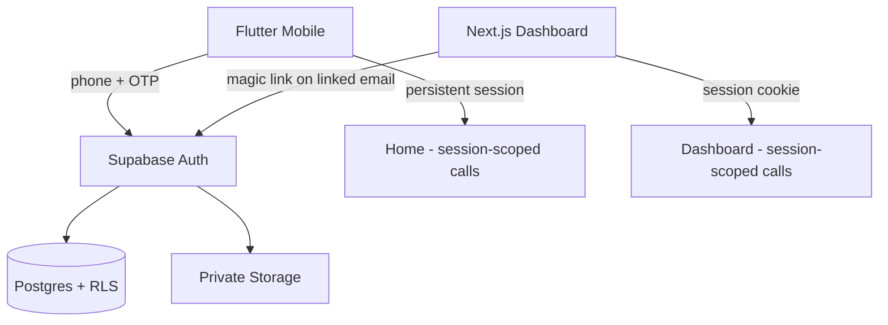

# Backend Architecture

## 1. Backend Responsibilities

The backend is the **single source of truth** for identity, business data, and receipt objects. Its responsibilities are:

1. **Identity** — authenticate mobile users (phone + OTP via Supabase Phone Auth + Twilio) and web users (email magic link on a linked identity), and issue/sustain sessions (Q-001…Q-004).
2. **Authorization** — enforce that every read/write is restricted to the owning business through Row Level Security and Storage policies (NFR-SEC-001, NFR-SEC-002).
3. **Data persistence** — store the business profile, categories, and transactions, and enforce data-integrity rules (type, EGP amounts, category uniqueness, hidden-not-deleted defaults).
4. **Object storage** — persist receipt images privately, owner-scoped, and linked to transactions (NFR-SEC-002).
5. **AI processing boundary** — host the server-side Edge Function that performs receipt extraction with Gemini, keeping the Gemini secret server-side (Q-007).
6. **Web access control** — model the linked email identity and enforce that unlinked web access is rejected on the next request (Q-015, Q-016).

The backend does **not** generate exports for MVP (client-side generation), does **not** run scheduled jobs, and does **not** offer any public/unauthenticated data surface.

## 2. Supabase Responsibilities

### 2.1 Authentication

| Capability | Detail | Source |
|---|---|---|
| Phone sign-up/login | Supabase Phone Auth with OTP; SMS via Twilio | BR-AUTH-001/002, Q-002 |
| OTP resend cooldown | 60-second cooldown, resend allowed after | BR-AUTH-003, Q-001 |
| Mobile session persistence | Persistent session until explicit logout; no inactivity timeout | FR-AUTH-006, Q-003 |
| Email identity linking | "Enable Web Access" attaches an email identity to the existing phone user; no second account | FR-SETTINGS-003, Q-016 |
| Magic-link web login | Email magic link on the linked identity | FR-WEB-AUTH-001, Q-004 |
| Account deletion | Owner can delete their account and all owned data | FR-SETTINGS-006 |

### 2.2 Database

- Postgres is the only database. One schema serves both clients (ASM-007).
- Every business-scoped relation derives ownership from the authenticated user → the user's single business profile (ASM-002/003).
- RLS is the enforcement mechanism; see §7.
- Key integrity rules (conceptual — SQL in the Database Design phase):
  - transactions carry a type (sale/income | purchase/expense) (BR-TRANS-001);
  - monetary amounts stored/written as numeric values; display-only EGP formatting lives in clients (Q-012);
  - each business gets the 10 default categories seeded on onboarding; defaults flagged as default and, when hidden, remain present for history (Q-010);
  - custom categories must not duplicate an existing default/custom after normalization (Q-021, BR-CATEGORY-008).

### 2.3 Storage

- A **private** bucket for receipt images (NFR-SEC-002, BR-SEC-002).
- Objects are organized per-owner (owner-scoped path) and are only readable/writable by the owning business through authenticated, policy-governed access (BR-REC-004).
- The client never exposes public URLs; reads use authenticated access (e.g., signed URLs or authenticated download).
- Images are uploaded only when a transaction is confirmed by the user (BR-CONFIRM-001); nothing is stored before confirmation (NFR-DATA-001).

### 2.4 Server-Side Processing

- The **only** custom server-side processing in MVP is the AI extraction Edge Function (`extract-receipt`), which mediates access to Gemini (Q-007) and returns non-persisted extraction results.
- It is JWT-verified and validates the caller's business ownership before spending AI calls.
- No other server code (no export generation, no cron, no webhooks, no realtime consumers) exists in MVP — those are Phase 2 seams.

## 3. Client / Server Responsibility Matrix

| Responsibility | Mobile | Dashboard | Supabase | AI Server Boundary |
|---|---|---|---|---|
| Authentication | UI + flow (phone/OTP) | UI + flow (magic link) | Identity, OTP, sessions, links | — |
| Business profile | Create / edit UI | Edit UI | Persistence + RLS | — |
| Receipt capture | Yes (camera/gallery) | No | — (storage on confirm) | — |
| Image quality check | Yes (advisory, on-device) | No | — | — |
| AI processing request | Yes | No | — | Entry point (verified JWT) |
| Receipt storage (on confirm) | Upload request | No | Private bucket + policies | No |
| Gemini call | No | No | — | Yes (holds secret) |
| Transaction CREATE | Request (after confirmation) | No (Q-005/Q-017) | Persistence + RLS | No |
| Transaction EDIT / DELETE | Request | Request | Persistence + RLS | No |
| Transaction READ | Request | Request | RLS-scoped access | No |
| RLS enforcement | No (subject to it) | No (subject to it) | **Yes** | Yes where applicable (ownership validation) |
| Category management | UI (shared table) | UI (shared table) | Persistence + uniqueness + RLS | No |
| Reports (summary/breakdown) | Display via RLS-scoped queries | Display via RLS-scoped queries | Data access | No |
| Export generation | Client-side + share sheet | Client-side + direct download | Data access only | No |
| Currency formatted EGP display | Yes | Yes | No (numeric storage) | No |
| Web access enable/verify/unlink | Enable (mobile) | View/unlink | Identity link + access check | — |

## 4. Authentication Boundary



- Mobile: authentication is **phone + OTP only** in MVP; no email/password (FR-AUTH-002, BR-AUTH-001, BR-MVP-002).
- Web: authentication is **magic link only**, and only for an email that was explicitly linked to a mobile-created user (BR-WEB-001/002/003, Q-016).
- Sessions: mobile persistent until logout (Q-003); web persists via cookie until logout or until access is revoked (Q-015).
- The authenticated identity is always the same underlying user (Q-016) — there is exactly one identity model with one set of ownership relationships.

## 5. Authorization Boundary

- The **authorization authority is the database**, via RLS (NFR-SEC-001, BR-SEC-001).
- Both clients send their own session; neither carries elevated privileges.
- The AI boundary re-validates the caller before invoking Gemini (defense in depth, and cost control).
- Storage policies mirror RLS: an owner may only access their private objects (NFR-SEC-002).
- Web access is an additional, per-request authorization condition: dashboard routes re-check that the linked email identity is still enabled (Q-015).
- **Never** rely on hiding UI elements as a control; all enforcement is server-side.

## 6. Data Ownership

The conceptual model (see `system-architecture.md` §8):

```text
auth.uid()  ──1:1──▶  Business profile  ──1:N──▶  Business data
                                                    ├─ categories
                                                    ├─ transactions
                                                    └─ receipt images (Storage)
```

- 1:1 user ↔ business in MVP (ASM-003).
- Every business-scoped row references its owning business; every storage object lives under the owner's path.
- Phase 2 multi-user extends ownership resolution to "member of the business" without changing the data model semantics.

## 7. RLS Architecture

Conceptual design (no SQL in this phase):

- **Row-scoped policies per business relation.** Each policy derives the owning business from `auth.uid()`. Queries, inserts, updates, and deletes are all scoped to the caller's own business.
- **Select defaults to owner-scope.** A user can only ever see rows belonging to their business; cross-tenant reads are structurally impossible.
- **Writes are owner-scoped** — create/edit/delete allowed only on the caller's own business rows. This governs mobile AND web identically (Q-017).
- **Default-category integrity is business-local**: seeding happens at onboarding (Q-010); hidden defaults remain present for historical transactions, reports, and filters (BR-CATEGORY-004).
- **Category uniqueness is business-scoped** and normalized (trim/case-fold/Arabic normalization) so a custom category cannot duplicate an existing one (Q-021).
- **Policy testability is a first-class requirement**: every policy gets tests (owner can, non-owner cannot) — the Database Design phase must include these.
- The web-access re-check (Q-015) is implemented as an authorization gate in the data-access path (server checks), not by revoking JWTs.

## 8. Storage Security Architecture

- Private bucket only; objects never public (NFR-SEC-002, ADR-005).
- Owner-scoped keys (`<business-id>/{transaction-id}/receipt.ext`).
- Access policies: upload on the owner's path; read/delete on the owner's path; all by authenticated session.
- No signed public URLs; the mobile and web clients use authenticated download paths.
- Orphan policy: objects are created only as part of a confirmed transaction; deletion removes the record and its image together (FR-TRANS-013).

## 9. Transaction Persistence

- **Confirm-then-write.** The user confirms on the Review & Edit screen; only then does the client upload the image (if any) and insert the transaction (BR-CONFIRM-001).
- The image upload and transaction insert are one logical commit. Ordering is defined in the implementation phase (image first or row first) with a defined failure/reconciliation rule so no orphan object or dangling reference is presented as "saved". MVP keeps this simple and retryable (client retries the failed leg).
- Manual transactions persist without an image (BR-REC-002).
- RLS governs every insert/update/delete.
- Concurrency: Last Write Wins (Q-006) — no optimistic-lock machinery in MVP.

## 10. Category Management

- Categories are a **shared, business-scoped** concept across mobile and web (Q-021, BR-CATEGORY-006).
- Defaults: seeded per business at onboarding; flagged default; cannot be deleted; hideable; hidden defaults remain valid for history/reports/filters and drop out of new-selection lists (Q-010, BR-CATEGORY-004).
- Custom: create/edit/delete by the owner from either client (BR-CATEGORY-005).
- Uniqueness: normalized comparison enforced server-side; clients mirror immediate feedback (Q-021).
- Usage counts for the web Categories view are derived from the transactions table (BR-CATEGORY-007).

## 11. Reporting Data Access

- Reports read **owner-scoped aggregate data** through RLS-narrowed queries (FR-DASH-001…007, FR-WEB-REPORT-001/002).
- Aggregates are computed live: income sum, expense sum, net, per-category sums for the unified periods (This Week / This Month / Last Month / Year-to-Date / Custom Range — Q-011).
- Indexing strategy (Database Design phase): owner + transaction date as the primary access path; category/type/amount-range filters extend it.
- No materialized views, caches, or warehouse in MVP — volumes are small and the requirement is not real-time analytics.

## 12. Web Access

- Enable from mobile Settings → email identity attached to the existing user; no second account (Q-016).
- Magic-link login on that identity (Q-004).
- Unlink (from mobile or web) → per-request authorization re-check rejects further web access; user returned to the disabled state and told to re-enable from mobile (Q-015, BR-WEB-006).
- RLS still applies for every data read/write; web create remains disabled at the application level (no create UI) **and** at the service layer if a guard is warranted (Q-005, Q-017).

## 13. AI Processing Boundary

- Only the `extract-receipt` Edge Function may call the Gemini API (Q-007).
- Enforcement: `verify_jwt = true`; the function re-checks the caller's business ownership before invoking Gemini; the Gemini key lives only in the function's environment/secret store (BR-AI-005, ADR-004).
- Input: receipt image bytes + transaction type + business context.
- Output: structured extraction result (fields + per-field confidence + overall confidence + outcome). **Never persisted** — persistence is the client's confirm step (NFR-DATA-001).
- The boundary isolates Gemini behind a stable interface so the model/provider can change without touching clients (ADR-004).

## 14. Error Handling

| Layer | Handling |
|---|---|
| Auth | OTP errors inline + 60s resend (FR-AUTH-004/005); magic-link expired → "send new link" (FR-WEB-AUTH-004) |
| RLS/data access | 403/Empty on cross-owner access; clients show generic "couldn't load" + retry |
| Persist transaction | Client treats (image upload + insert) as one operation; failure → retryable error state, no partial success presented (AC-REVIEW-005) |
| Delete | Record + image removal; failure surfaced, record retained |
| AI boundary | Extraction failure/timeout at client (Q-008, Q-009); the function returns a structured failure to avoid ambiguous states |
| Offline | No network → clear "internet required" message + retry; no queueing (Q-018) |

## 15. Security

- RLS on all business data (NFR-SEC-001).
- Private storage with owner-scoped policies (NFR-SEC-002).
- AI secret only in the Edge Function (Q-007, BR-AI-005).
- Service-role key never used in client flows; the Supabase service role is used only server-side (Edge Functions / admin needs) and never exposed.
- Verifying JWTs on the AI boundary; ownership check before each AI call.
- No public endpoints, no public storage, no unauthenticated data path.
- Account deletion removes the business and its data (FR-SETTINGS-006).

## 16. Performance

- **Solo-shop volumes** — thousands of rows per business per year. Simple indexed, RLS-scoped queries are sufficient.
- Primary indexes: owner+business resolution, transaction date; category/type/amount range filters use standard indexes designed in the Database phase.
- AI calls bounded: image compressed client-side before send; 15-second client-visible ceiling (Q-009); quality check filters obviously unusable images before any server cost (Q-020).
- Storage reads: thumbnails resized on demand; full-size images load only in detail views.

## 17. Scalability

- Supabase scaling model (shared Postgres → dedicated compute) requires no application change; the schema is already tenant-scoped.
- The AI Edge Function is stateless and horizontally scaleable by the platform.
- If report queries ever outgrow live aggregation for a business, the extension is a materialized/summary table behind the same RLS — not a new architecture.
- Client-side export can move to a server-side Edge Function for large datasets without model changes.

## 18. Phase 2 / Phase 3 Extensions

| Extension | Backend changes |
|---|---|
| Multi-user access | Membership relation + RLS generalization from owner to member-with-role (ASM-002, ASM-006) |
| Real-time sync | Supabase Realtime on RLS-scoped tables; unchanged ownership model (Q-006 note) |
| Offline capture + sync | Client-side local queue; backend unchanged (accepts confirmed writes on reconnect) (BR-MVP-004) |
| Duplicate receipt hash | Hash stored/checked at confirm time; no flow change |
| ETA integration | Export mapping/adapters or a submission Edge Function; no core change |
| Push notifications | cron/scheduled Edge Functions over RLS-scoped data |
| WhatsApp submission | New ingestion Edge Function feeding the same extraction + confirmation path |
| Server-side export | Export Edge Function reading owner-scoped data via the caller's JWT |

## 19. Risks

| Risk | Mitigation |
|---|---|
| RLS misconfiguration → cross-business leak | Policy tests mandatory; security advisors/checks in CI; per-table policy review (NFR-SEC-001) |
| Storage bucket made public accidentally | Private bucket default; ownership policies; security review + tests (NFR-SEC-002) |
| Gemini key leakage | Key only in Edge Function secrets; verify_jwt; audit access (Q-007) |
| SMS provider reliability in Egypt | Twilio selection (Q-002); resend + support path |
| Last-write-wins silently losing an edit | Accepted MVP decision (Q-006); Phase 2 realtime/conflict review |
| Edge Function abuse/cost | Verified JWT + ownership check + quality gate before AI calls |
| Orphaned objects on partial confirm failures | Defined two-leg ordering + cleanup/reconciliation rule in the Database/Implementation phases (FR-TRANS-013) |

## 20. Traceability

| Backend element | Requirement / decision IDs |
|---|---|
| Phone + OTP auth, 60s cooldown, Twilio, persistent session | FR-AUTH-001…007, BR-AUTH-001…004, Q-001, Q-002, Q-003 |
| Business profile + EGP default | FR-ONBOARD-001…005, BR-BUS-001…003, Q-012 |
| RLS (all business tables) | NFR-SEC-001, BR-SEC-001, Q-017 |
| Private owner-scoped storage | NFR-SEC-002, BR-REC-004, BR-SEC-002 |
| Confirm-then-persist | FR-REVIEW-002, BR-CONFIRM-001, NFR-DATA-001 |
| Categories (defaults/hide/custom/uniqueness/shared) | FR-CATEGORY-001…005, BR-CATEGORY-001…008, Q-010, Q-021 |
| Transactions CRUD + delete cascade | FR-TRANS-001…013, BR-TRANS-001…007, Q-006 |
| Reports data access (unified periods) | FR-DASH-004…006, FR-WEB-REPORT-001/002, BR-REPORT-001…003, Q-011 |
| Export data access (period + filters) | FR-EXPORT-001…003, BR-EXPORT-001…003, Q-012, Q-013, Q-014 |
| Web access model + unlink behavior | FR-SETTINGS-003, FR-WEB-AUTH-001…004, FR-WEB-SETTINGS-002, BR-WEB-001…006, Q-004, Q-015, Q-016 |
| AI boundary (server-side Gemini, secret) | FR-AI-001, BR-AI-005, Q-007 |
| MVP boundaries | BR-MVP-001…006, Q-005, Q-017, Q-018 |