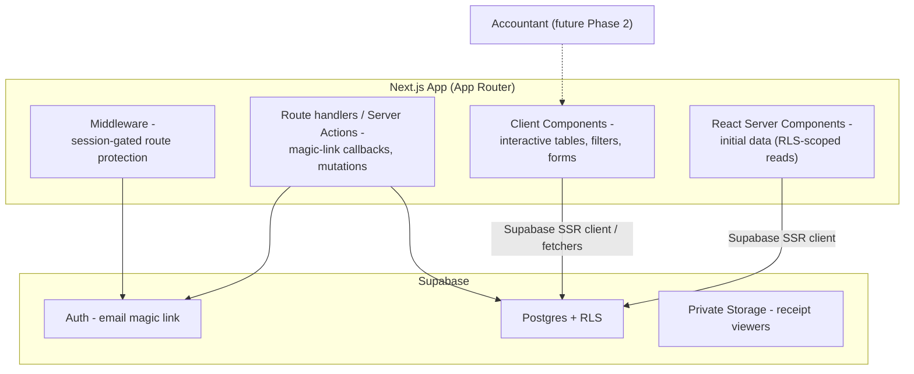
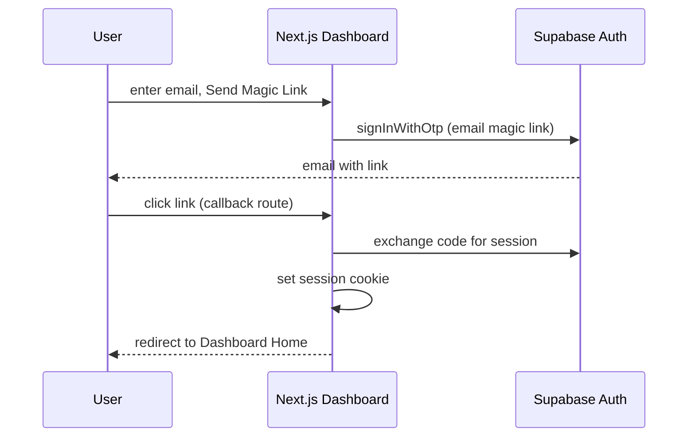

# Dashboard Architecture

## 1. Purpose

This document defines the architecture of the **Next.js web dashboard** — the companion view to the Flutter mobile app. It covers the dashboard's role, architectural style, feature boundaries, authentication and session management, Supabase integration, data-access boundaries, transactional editing, reporting, export, state handling, authorization, security, performance, and the future multi-user extension.

The dashboard reads and writes the **same Supabase tables** as the mobile app; there is no separate backend (ASM-007, ADR-002).

## 2. Dashboard Role

- The dashboard is a **companion view** for reviewing data on a bigger screen, running reports, and light management (ASM-001, ASM-005).
- MVP capability split (Q-005, Q-017):

```text
READ      ✅ Mobile + Web
EDIT      ✅ Mobile + Web
DELETE    ✅ Mobile + Web
CREATE    ❌ Mobile only in MVP
```

- Receipt capture (camera + AI extraction) remains **mobile-only** for the MVP (BR-WEB-005).
- No independent web signup; the mobile app is the source of truth for account creation (BR-WEB-001).
- The dashboard must mirror mobile behavior for filters, search, report periods, and categories so the two experiences stay consistent (BR-WEB-002/003/006, FR-WEB-TRANS-002, FR-WEB-DASH-003).

## 3. Architectural Style

Next.js with the **App Router**, Supabase SSR integration, and a server/client component split (ADR-001).



- **React Server Components** provide initial RLS-scoped reads (Dashboard Home, Transactions first page, Reports, Categories) — fast and secure by default.
- **Client Components** handle interactivity: sortable/paginated tables, filter bars, search, edit/delete actions, charts, and download triggers.
- **Server-side mechanics** are limited to what requires the server: magic-link redirect handling, mutations that must run with the server Supabase client, and route protection via middleware. Wherever possible, mutations use row-level, session-scoped Supabase calls so RLS is the enforcement layer.
- No heavy client state library is required for MVP; lightweight state (React state + URL search params for filters/periods) is sufficient. Server-fetched data is refreshed via router refresh / targeted refetch after edits.

## 4. Application Boundaries

- The dashboard has **no independent authentication** — it only grants access to users whose email identity is linked to an existing mobile-created Supabase user (Q-004, Q-016, BR-WEB-002/003).
- The dashboard **cannot create transactions** (Q-005, Q-017) and does not offer a capture/AI surface (BR-WEB-005).
- All data access is session-scoped and RLS-governed; the dashboard never uses the service-role key (NFR-SEC-001).
- Receipt images are rendered through authenticated Storage reads, never public URLs (NFR-SEC-002, ADR-005).
- The dashboard is RTL-capable and Arabic-first, mirroring the mobile app (NFR-LANG-001, Q-019); it renders the same EGP currency format (Q-012).

## 5. Feature Boundaries

### 5.1 Web Login

- Landing/login page: email input + "Send Magic Link" (FR-WEB-AUTH-001).
- Link click → Supabase magic-link callback → redirect to Dashboard Home (FR-WEB-AUTH-001).
- Unlinked email → blocked with the message "This email isn't linked to a business account. Enable web access from the mobile app first." — no self-signup (FR-WEB-AUTH-002, BR-WEB-001/003).
- Expired/used link → "Link expired" + "Send new link" (FR-WEB-AUTH-004, BR-WEB-004 note).
- Session persists until explicit logout (FR-WEB-AUTH-003).

### 5.2 Overview

Landing screen after login (FR-WEB-DASH-001):

- Summary cards: Total Income / Total Expenses / Net for the current month by default (FR-WEB-DASH-002), formatted as EGP (Q-012).
- Category breakdown chart, same underlying data as mobile Reports (FR-WEB-DASH-003).
- Recent transactions — last 10, each linking to full detail (FR-WEB-DASH-004).
- Period comparison vs previous month (FR-WEB-DASH-005).
- Top navigation: Overview / Transactions / Reports / Categories / Settings (FR-WEB-DASH-006).

### 5.3 Transactions

- Data table: sortable columns, pagination — date, type, vendor/customer, category, amount, receipt thumbnail (FR-WEB-TRANS-001).
- Filter bar: date range / category / type / amount range, mirroring mobile (FR-WEB-TRANS-002).
- Search by vendor/customer name only (FR-WEB-TRANS-003, Q-022).
- Row click → detail panel (drawer/modal): read-only fields by default + full-size receipt image viewer (FR-WEB-TRANS-004).
- Edit → inline editable form → Save updates the same Supabase record (FR-WEB-TRANS-005, BR-TRANS-005).
- Delete → confirmation dialog (FR-WEB-TRANS-006).
- **No "Add Transaction" button** in MVP (Q-005, ASM-005).

### 5.4 Reports

- Unified period selector: This Week / This Month / Last Month / Year-to-Date / Custom Range (FR-WEB-REPORT-001, Q-011).
- Summary cards + category breakdown, same data model as mobile (FR-WEB-REPORT-002, BR-REPORT-002).
- Export button → PDF or Excel/CSV → direct download (FR-WEB-REPORT-003), scoped to the selected period **and** current filters (Q-014).
- The Reports screen is the surface most likely to be used by an accountant in a future Phase 2 multi-user scenario (ASM-006).

### 5.5 Categories

- Table of all categories (default + custom) with a **usage count** per category (FR-WEB-CATEGORY-001, BR-CATEGORY-007).
- Add / edit / delete **custom** categories, mirroring mobile Settings against the same table (FR-WEB-CATEGORY-002, BR-CATEGORY-005/006).
- Default categories: hidden but not deleted (FR-WEB-CATEGORY-003, BR-CATEGORY-004).
- Custom-category name normalized and rejected if it duplicates an existing default/custom (Q-021, BR-CATEGORY-008); the server enforces it, the UI mirrors it.

### 5.6 Settings

- Business profile (name, type) editable; syncs with mobile (FR-WEB-SETTINGS-001, BR-BUS-004).
- Web Access: view / unlink the linked email identity (FR-WEB-SETTINGS-002, Q-015).
- Logout (FR-WEB-SETTINGS-003).

## 6. Authentication



- Implemented with Supabase email/magic-link auth (Q-004, ASM-013).
- The email identity must already be linked to a Supabase user from the mobile "Enable Web Access" flow; otherwise login is blocked (FR-WEB-AUTH-002, BR-WEB-002/003).
- No email/password and no registration UI on the web (BR-MVP-002, BR-WEB-001).

## 7. Session Management

- Session held in an HttpOnly, SameSite cookie via `@supabase/ssr` (server-accessible), refreshed by Supabase helpers on each request.
- Middleware protects dashboard routes: no session → redirect to login.
- Session persists until explicit logout (FR-WEB-AUTH-003).
- **Access re-check on every request**: even with a valid cookie/JWT, dashboard server routes re-validate that web access is still enabled (ownership + link present). If unlinked, the next authenticated request is rejected and the user is returned to the access-disabled state with messaging to re-enable from the mobile app (Q-015, BR-WEB-006).
- Logout clears the session cookie and returns to login (FR-WEB-SETTINGS-003).

## 8. Supabase Integration

- **SSR client** (`@supabase/ssr`) with cookie storage is the only integration path.
- Reads in Server Components / route handlers use the caller's session → RLS scoping (NFR-SEC-001). No service-role key anywhere in the app (only server env-var holds project URL / anon/publishable key, which is public-safe).
- Mutations (edit/delete/settings/categories) run with the user's session so RLS authorizes each row (Q-017).
- Storage: authenticated reads for receipt images (ADR-005).
- One Supabase project is shared with mobile — same tables, same RLS (ASM-007, BR-CATEGORY-006).

## 9. Data Access Boundaries

| Boundary | Access |
|---|---|
| Web login | Supabase Auth only; blocked unless email is linked (Q-016) |
| Business data reads | Session-scoped, RLS-narrowed queries (NFR-SEC-001) |
| Transaction edit/delete | Session-scoped mutations on owner rows only (Q-017) |
| Transaction create | **Not available on web** (Q-005, Q-017) |
| Receipt images | Authenticated private-Storage reads (NFR-SEC-002) |
| Reports/aggregates | RLS-scoped queries over owner rows |
| Categories | Session-scoped reads/writes on shared table (Q-021) |
| Business profile / web access | Session-scoped owner-only writes |

No dashboard code path may fetch data without the caller's session; the service role is never used.

## 10. Transaction Editing

- Detail panel "Edit" → inline form pre-filled from the record (FR-WEB-TRANS-004/005).
- Save issues a session-scoped UPDATE on the record; RLS ensures the record belongs to the caller (Q-017, BR-TRANS-005).
- After save, the UI refreshes server data so list, detail, and dashboard totals reconcile (AC-WEB-TRANS-005).
- No create path exists anywhere in the web app (Q-005).
- Validation mirrors mobile: type, amount numeric, category from the owner's categories, date bounds (BR-TRANS-001, Q-012).
- Concurrent edits: Last Write Wins; no conflict UI in MVP (Q-006).

## 11. Reporting

- Reports aggregate over the owner's rows within the selected period (Q-011): income sum, expense sum, net, and per-category breakdown sorted by spend (FR-WEB-REPORT-002, BR-REPORT-001/002).
- View-state period is reflected in the URL (search params) so filter/period combos are shareable and survive navigation; this also feeds the export scope (Q-014).
- Computed live from transaction data; no cached/warehouse layer in MVP (keep it simple).
- Chart/library choice stays lightweight; the web has no low-end-device constraint but consistency of numbers with mobile is mandatory (BR-REPORT-002/004).

## 12. Export

- Export button (Reports) → choose PDF or Excel/CSV → direct download; no share sheet (FR-WEB-REPORT-003).
- Scope = period + active filters (category, type, amount range) (Q-014).
- Content follows Q-013: PDF = period + income + expenses + net + category breakdown + transaction list; Excel = Summary / Transactions / Categories sheets; CSV = flat transaction-level data.
- Numbers formatted as EGP for display; underlying values remain machine-readable (Q-012, BR-EXPORT-003).
- Generation runs client-side from the RLS-scoped dataset already loaded by the report view. (Server-side generation is a Phase 2 extension point for very large datasets.)

## 13. Error / Empty / Loading States

- **Loading**: skeleton rows/cards on first paint and during refetches.
- **Empty** (Q-019): Home / Transactions / Reports show the Arabic empty-state copy — "لا توجد معاملات بعد" with guidance "أضف أول معاملة من تطبيق الهاتف لبدء متابعة نشاطك التجاري." — and never a blank/broken screen; no create CTA on web since creation is mobile-only.
- **Auth errors**:
  - Unlinked email → explanatory message, no signup (FR-WEB-AUTH-002).
  - Expired/used link → "Link expired" + "Send new link" (FR-WEB-AUTH-004).
  - Access disabled after unlink → message to re-enable from mobile (Q-015).
- **Data errors** (RLS-denied, offline, RPC failure): clear message + retry, consistent with mobile conventions.

## 14. Authorization

- **No web component is ever the security boundary.** UI hides Edit/Delete only when appropriate, but enforcement is entirely server-side via RLS and the per-request web-access re-check (Q-015, Q-017, NFR-SEC-001).
- Route protection (middleware) is UX, not security: all server fetches and mutations enforce ownership regardless of client state.
- Web access is tied to the same `auth.uid() → business` ownership as mobile — there is no second identity or separate dataset (Q-016).

## 15. Security

- Secrets: no Gemini key, no service-role key, no Twilio credentials ever reach the dashboard (Q-007, Q-002, BR-AI-005).
- Cookies: HttpOnly, SameSite; Supabase SSR manages refresh.
- Every data op session-scoped → RLS enforced (NFR-SEC-001).
- Receipt images private + authenticated (NFR-SEC-002).
- CSRF/XSS posture: React default escaping; mutations via session-scoped server actions/route handlers with owned-row checks.
- Magic-link exchange must handle expired/already-used links gracefully (FR-WEB-AUTH-004).
- Unlink semantics honored on the next request (Q-015).

## 16. Performance

- Server Components render initial data with RLS-scoped, index-friendly queries; pages keep payloads small (Dashboard Home limits to 10 recent transactions — FR-WEB-DASH-004; Transactions table paginates — FR-WEB-TRANS-001).
- Aggregates are simple `SUM`/`GROUP BY` over owner rows; adequate for solo-shop volumes — no caching/OLAP in MVP.
- Client bundle kept lean: interactive parts (tables, charts, edit forms) lazy/downloaded as needed; chart library only loaded on pages that render charts.
- Image thumbnails served at reduced size via Storage transformations; full-size loaded on demand in the detail panel (NFR-SEC-002).

## 17. Future Multi-User Extension

- Phase 2 multi-user (owner + employee, restricted permissions) builds on the unchanged ownership model: a membership table maps additional users to the business, and RLS generalizes from "owner" to "member with role/permission" (ASM-002, ASM-006).
- The dashboard is the intended shared surface for an accountant (ASM-006); its read/report/export focus already matches a restricted access profile. Roles would gate Edit/Delete (and business settings) while keeping Overview/Reports/Categories readable.
- Real-time sync (Realtime subscriptions) is a Phase 2 consideration to keep web and mobile views fresh (Q-006 edge case); MVP remains Last Write Wins.
- No multi-user scaffolding is built in MVP.

## 18. Traceability to Requirements

| Dashboard element | Requirement / decision IDs |
|---|---|
| Magic-link login, blocked unlinked email, session persistence | FR-WEB-AUTH-001…004, BR-WEB-001…004, Q-004, Q-016 |
| Overview + summary + breakdown + recent | FR-WEB-DASH-001…006, Q-012, Q-019 |
| Transactions table, filters, search, detail, edit, delete | FR-WEB-TRANS-001…006, BR-TRANS-005…007, Q-005, Q-017, Q-022 |
| Reports + unified periods | FR-WEB-REPORT-001/002, BR-REPORT-002/003, Q-011 |
| Export download + scope | FR-WEB-REPORT-003, BR-EXPORT-001…003, Q-012, Q-013, Q-014 |
| Categories with usage count + rules | FR-WEB-CATEGORY-001…003, BR-CATEGORY-004…008, Q-010, Q-021 |
| Settings (profile, web access, logout) | FR-WEB-SETTINGS-001…003, BR-BUS-004, Q-015 |
| RLS / private storage / no service role | NFR-SEC-001, NFR-SEC-002, BR-SEC-001/002 |
| Arabic-first RTL + EGP formatting | NFR-LANG-001, Q-012, Q-019 |
| Multi-user / real-time as Phase 2 | ASM-002, ASM-006, Q-006, requirements §4.2 |