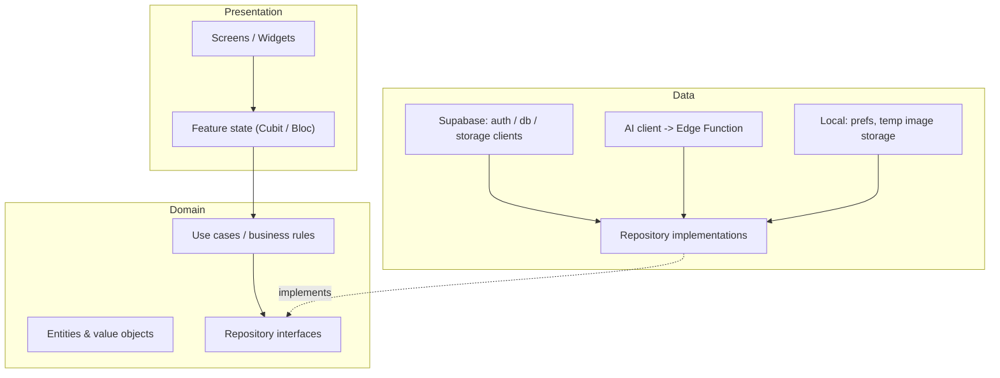

# Mobile Architecture

## 1. Architecture Goals

The Flutter mobile app is the **primary product experience** (ASM-001). Its architecture must:

1. Support the core capture loop (Home → Add Transaction → Sale/Purchase → Camera/Gallery/Manual → AI Processing → Review & Edit → User Confirmation → Persist) as a smooth, low-latency flow.
2. Enforce, by construction, that **AI output never persists without user confirmation** (NFR-DATA-001, BR-AI-001).
3. Keep business and AI logic out of widgets so it is unit-testable without UI.
4. Stay lightweight for low/mid-spec Android devices (NFR-LOWDEV-001, ASM-008).
5. Support Arabic-first RTL UI with an English toggle (NFR-LANG-001, ASM-015).
6. Isolate Supabase (auth/db/storage) behind repository interfaces so infrastructure swap and offline sync extensions remain possible without core changes.
7. Make capture **local-first**: capture works with no connectivity as a device-local pending capture, deferring AI processing + sync until online (Q-018 flipped IN MVP; ADR-007); AI output still never persists without user confirmation.

## 2. Architectural Style

Layered Clean Architecture (Presentation → Domain → Data) organized **feature-first**, with a thin shared core. This is a pragmatic interpretation for a mobile client — no enterprise ceremony (ADR-001).



- **Feature-first modules** — each feature (`auth`, `onboarding`, `capture`, `review`, `transactions`, `categories`, `reports`, `export`, `settings`) owns its presentation + domain + data slices. Cross-feature use cases (e.g., "save confirmed transaction") live in domain and are shared.
- **Dependency rule** — Presentation depends on Domain; Domain depends on interfaces, not on Supabase/UI packages. Data implements Domain interfaces.
- **MVVM-lite with Bloc/Cubit** — widgets are dumb; a per-feature **Cubit or Bloc** holds UI state and invokes use cases. Cubits cover straightforward states (data / loading / empty / error); Blocs are used where events and side effects matter (auth lifecycle, capture → AI → review). No BuildContext-dependent business logic.
- **No over-engineering** — no complex plugin system, no event bus, no distributed state. One app-level auth Bloc for session/splash; lightweight per-feature Cubits/Blocs elsewhere.

## 3. Application Boundaries

- **Capture is local-first (offline, MVP):** the image and selected metadata are stored on-device as a pending capture when offline and synced (upload → AI → persistence) when connectivity returns. AI, upload, server-side persistence, cross-device sync, and reports over unsynced data are **online-only** (Q-018 flipped, ADR-007, FR-OFFLINE-001..008, BR-OFFLINE-001..008).
- The app holds **no business data of its own** beyond transient in-memory state, local temp files for an in-progress capture, a **device-local pending queue** (un-synced captures), and a **read-only cache of previously loaded data** for offline Home display (never implying cloud sync).
- The app **never holds the Gemini key** or any service-role credentials (Q-007, BR-AI-005).
- All server requests carry the user's session; the app is fully subject to RLS (NFR-SEC-001).
- The app **never renders a receipt image from a public URL** — every stored image is fetched through authenticated Storage access.

## 4. Layered Architecture

### 4.1 Presentation Layer

- Screens and widgets for each feature; RTL-aware layouts, Arabic-first strings via **easy_localization** (JSON string catalogs with live locale switching and persisted preference).
- Interactive widgets: bottom navigation (Home / Transactions / Reports / Settings), the floating Add button, forms, filter bars, dialogs, share sheet invocation, camera/gallery pickers.
- Per-feature Cubits/Blocs that expose a minimal state model (data, loading, empty, error) to the UI; widgets consume them via `BlocBuilder` / `BlocListener` / `BlocSelector` and never mutate state directly.
- No business logic in widgets — widgets map state to UI and forward user intents to the state objects.

### 4.2 Domain Layer

- **Entities/value objects**: `Transaction` (type sale/purchase, date, amount, vendor/customer, category, line items, image reference), `Category` (default/custom, hidden), `BusinessProfile`, `TransactionFilter` (date range, category, type, amount range), `ReportPeriod` (This Week / This Month / Last Month / Year-to-Date / Custom Range — Q-011), `ExportScope`, `ExtractionResult`.
- **Use cases**: `ConfirmAndPersistTransaction`, `ExtractReceipt`, `LoadTransactions`, `ApplyFilters`, `SearchTransactions`, `LoadReportsSummary`, `LoadCategoryBreakdown`, `ExportReport`, `ManageCategories`, `UpdateBusinessProfile`, `EnableWebAccess`, `DeleteTransaction`, `DeleteAccount`.
- **Repository interfaces**: `AuthRepository`, `BusinessRepository`, `TransactionRepository`, `CategoryRepository`, `StorageRepository`, `ReportRepository`, `AIFeatureExtractionRepository`.
- **Validation rules** live in the domain: transaction type required, amount numeric, required extraction fields policy (mirror of Q-008), category-normalized duplicate check (mirror of Q-021), period computation, export scope (period + filters, Q-014).

### 4.3 Data Layer

- Repository implementations over **Supabase** (auth, PostgREST, Storage) and the **AI Edge Function** client.
- A local temporary cache for the in-progress capture image (app temp directory) so a captured photo survives a configuration change without being persisted to the backend.
- Shared-preference storage for locale preference (Arabic default / English — FR-SETTINGS-004, ASM-015).
- Data mappers translate Supabase row ↔ domain entities; the domain never sees raw JSON.

### 4.4 Core / Shared Layer

- `AppNavigation` — centralized **go_router** route table (shell + per-tab stacks; see §6).
- `SessionWatch` — wires Supabase auth state changes into the app-level auth Bloc (drives splash/redirect and auth gating).
- `Locales` — RTL/locale configuration, number/currency formatting (EGP `1,250.50 ج.م`, Q-012, BR-REPORT-004).
- `ErrorHandling` — mapping of network/auth/storage/AI errors to user-facing states.
- `EgCurrency` — single EGP formatting/parsing utility used by presentation and export (Q-012).

## 5. Feature Boundaries

### 5.1 Authentication

- Splash screen → session check (FR-AUTH-007): active session → Home, else Phone Entry.
- Phone Entry (FR-AUTH-001) → request OTP. OTP screen (6-digit, FR-AUTH-003) verifies via Supabase Phone Auth (Q-002, Twilio).
- Wrong code → inline error (FR-AUTH-004). Resend gated by a **60-second cooldown** with visible countdown (Q-001); support link (FR-AUTH-005).
- Session persistence: Supabase persistent session until explicit logout, no inactivity timeout (FR-AUTH-006, Q-003).
- No email/password UI anywhere (FR-AUTH-002, BR-AUTH-001).

### 5.2 Onboarding

- After first successful login, Business Setup is a hard gate: business name + business type dropdown (Retail / Restaurant / Pharmacy / Service / Other) (FR-ONBOARD-001…003).
- Default currency EGP recorded (FR-ONBOARD-004).
- On confirm → create business profile + seed default categories (Q-010) → route Home (FR-ONBOARD-005).
- Returning users skip onboarding (AC-ONBOARD-004).

### 5.3 Receipt Capture

- Floating "+" reachable in one tap from Home (FR-CAPTURE-001); opens Type Selector (Sale/Income or Purchase/Expense) (FR-CAPTURE-002).
- Capture UI: in-app camera (FR-CAPTURE-003) or gallery pick (FR-CAPTURE-004); or "Skip — enter manually" straight to an empty Review & Edit form (FR-CAPTURE-007, BR-REC-002).
- **Advisory image quality check** runs on-device before upload with three outcomes (FR-CAPTURE-005, Q-020): PASS → proceed; WARNING → user may continue; REJECT → prompt to retake. Implemented with lightweight heuristics (brightness distribution, blur/focus estimate); explicitly **not** a strict gate.
- Offline: capture proceeds locally as a pending capture (image + type + optional metadata) with no network required; status "waiting for connection"; sync runs manually ("Sync now") and/or automatically on reconnect (FR-OFFLINE-001..004; ADR-007).
- Pre-upload, the image is held in the app temp area (not uploaded, not persisted server-side).

### 5.4 AI Extraction

- Sends the captured image bytes + transaction type + business context to the server-side AI boundary (`extract-receipt` Edge Function) with the user's session (FR-AI-001).
- Shows a clear loading state; never a frozen screen (FR-AI-007, NFR-PERF-001).
- A **15-second client-visible timeout** bounds the wait; on timeout or failure → message + "Enter manually instead" (FR-AI-008, Q-009). Never a dead end.
- Receives a structured `ExtractionResult` (fields + per-field confidence + overall confidence + outcome) that exists only in memory. **Nothing is persisted.**
- Non-receipt / empty result → "Couldn't read this as a receipt, try again or enter manually" (FR-AI-009).

### 5.5 Review and Edit

- Pre-filled editable form from the extraction result (FR-REVIEW-001/003).
- Field confidence < 80% → visually flag (subtle highlight) prompting double-check (FR-AI-004, Q-008).
- Photo thumbnail tappable to full size (FR-REVIEW-005).
- Category picker defaults to AI suggestion, editable (FR-REVIEW-004, FR-CATEGORY-002).
- **Save is the confirmation gate**: on Save, the app uploads the image to private Storage and creates the transaction (BR-CONFIRM-001, FR-REVIEW-002). Success feedback → Home with refreshed totals (AC-REVIEW-005).
- The same form is reused for editing a past entry (pre-filled with saved values) (FR-TRANS-011).

### 5.6 Categories

- Manage Categories from Settings (FR-SETTINGS-002): list defaults + custom.
- Default categories (10, Q-010) seeded at onboarding; **cannot be deleted, only hidden** (FR-CATEGORY-005, BR-CATEGORY-004).
- Add/edit/delete custom categories (FR-CATEGORY-003/004).
- New custom category name normalized (trim, case-fold, Arabic normalization) and rejected if it duplicates an existing default/custom after normalization (FR-CATEGORY-003, Q-021). Rendered server-side as source of truth; mirrored client-side for immediate UX.
- Categories are the **shared state across mobile and web** (Q-021, BR-CATEGORY-006).

### 5.7 Transactions

- List screen: chronological, most recent first, grouped by date (FR-TRANS-001/002); rows show thumbnail, vendor/customer, category, color-coded amount, date (FR-TRANS-003).
- Filter bar: date range / category / type / amount range (FR-TRANS-004…007).
- Search: vendor/customer name only (FR-TRANS-008, Q-022).
- Detail view: read-only by default with full-size image (FR-TRANS-009/010); Edit → Review & Edit form (FR-TRANS-011); Delete → confirmation dialog → remove record + image (FR-TRANS-012/013). No undo/trash (BR-TRANS-004).
- Concurrent edits: Last Write Wins (Q-006).

### 5.8 Reports

- Home summary: income / expenses / net for current month, large glanceable numbers in EGP (FR-DASH-001, Q-012).
- Home breakdown by category + month-over-month comparison (FR-DASH-002/003).
- Reports tab: unified period selector (This Week / This Month / Last Month / Year-to-Date / Custom Range — Q-011); summary cards (FR-DASH-005); category breakdown sorted by highest spend (FR-DASH-006, BR-REPORT-001); comparison vs previous period (FR-DASH-007).
- Reports are computed from RLS-scoped queries via the report repository; no local report cache.

### 5.9 Export

- Export Options sheet: format (PDF / Excel / CSV) + period defaulting to current selection (FR-EXPORT-001).
- Export scope = selected period **and** currently applied filters (category, type, amount range) (Q-014).
- PDF: report period, income, expenses, net, category breakdown, transaction list (Q-013).
- Excel: three sheets — Summary, Transactions, Categories (Q-013).
- CSV: flat transaction-level data (Q-013).
- Generation is client-side from the data already fetched under RLS (lightweight PDF/Excel/CSV generators); amounts formatted as EGP with machine-readable numerics (Q-012, BR-EXPORT-003).
- On generation → share sheet (WhatsApp, email, save…) (FR-EXPORT-004).

### 5.10 Settings

- Business profile edit (name, type) (FR-SETTINGS-001).
- Manage Categories (FR-SETTINGS-002).
- **Enable Web Access** — optional; links/verifies an email onto the existing user (FR-SETTINGS-003, Q-016).
- Language toggle: Arabic (default, RTL) / English (FR-SETTINGS-004, ASM-015).
- Logout (FR-SETTINGS-005).
- Delete account with confirmation + data-loss explanation (FR-SETTINGS-006).

## 6. Navigation Architecture

- **go_router is the navigation system**: a single declarative `GoRouter` under the root MaterialApp (RTL-capable). All routes live in one typed route table; screens are navigation-agnostic and never call `Navigator` directly — they navigate via `context.go` (shell/tab changes) and `context.push`/`context.pop` (flow routes).
- **Auth gate** — a top-level `redirect` reads the auth Bloc state and routes splash → Phone Entry vs Home (FR-AUTH-007).
- **Onboarding gate** — a second `redirect` blocks entry until a business profile exists (first login only).
- **Tabbed shell** via `StatefulShellRoute.indexedStack` with four destinations — Home, Transactions, Reports, Settings — preserving each tab's own navigation stack (bottom navigation per user flows §1/§2/§4/§5).
- **Flow routes** split into `push` branches layered above the shell: Type Selector → Capture → Processing → Review & Edit; Transaction Detail; Export Options; Settings sub-screens.
- Per-tab back stacks preserve context; the floating "+" is reachable from Home (FR-CAPTURE-001).
- **Deep links as a side benefit**: because routes use URL-style paths (e.g., `/transactions/:id`), Phase 2 deep links (notifications, sharing) work without refactoring screens.

## 7. State Management Responsibilities

State is managed with **Bloc/Cubit** (`flutter_bloc`). **Cubits** cover simple states (data / loading / empty / error toggles, forms, filter selection); **Blocs** are used for event-driven flows with multiple events and required side effects (auth, capture → AI → review, transactions list). Each feature exposes one immutable state class the UI renders.

- **Auth/session state** — app-wide: current user, session status, whether a business profile exists. Wired to Supabase auth state changes (FR-AUTH-006).
- **Onboarding state** — business name/type form + submit intent.
- **Capture/processing state** — transaction type, in-progress image reference, quality-check outcome, AI lifecycle (loading / success / failure / timeout), extraction result in memory.
- **Review & edit state** — the editable draft transaction, per-field confidence flags from the extraction result, category picker selection, save intent.
- **Transactions list state** — filters + search + pagination for the list.
- **Reports state** — period selector, summary/breakdown/comparison data, export scope.
- **Settings state** — category management, business profile, language, web-access, logout/delete.
- **Injection** — constructor injection via `BlocProvider` / `MultiBlocProvider` scoping (a lightweight service construction at the shell); repositories and use cases are provided once and features consume them. No global mutable state for transient flows.

## 8. Domain / Use Case Boundaries

- Use cases are the **only** entry points that mutate domain state or call repositories.
- UI intents map 1:1 to use cases (e.g., `onSaveTapped` → `ConfirmAndPersistTransaction(editedDraft)`).
- Business rules enforced in domain:
  - transaction type required (BR-TRANS-001);
  - confirmation gate before any write (BR-CONFIRM-001);
  - required-field policy & confidence semantics mirror (Q-008);
  - category hidden-not-deleted + normalized uniqueness (Q-010, Q-021);
  - report period semantics unified (Q-011);
  - amount storage numeric, EGP (Q-012);
  - search scope vendor/customer only (Q-022);
  - export scope = period + filters (Q-014);
  - edit/delete rules and confirmation-first delete (BR-TRANS-002/004).
- Domain is pure Dart (no Flutter/Supabase imports), which keeps it unit-testable.

## 9. Repository Boundaries

| Repository | Purpose | Backing |
|---|---|---|
| `AuthRepository` | OTP request/verify, session state, logout, delete account | Supabase Auth |
| `BusinessRepository` | Create/read/update business profile, web-access link/unlink | Supabase DB + Auth |
| `CategoryRepository` | List/create/edit/delete/hide categories, normalized uniqueness | Supabase DB |
| `TransactionRepository` | CRUD queries with filters/search; delete cascade (record + image) | Supabase DB + Storage |
| `StorageRepository` | Upload/link receipt image on confirm; signed/authenticated reads | Supabase Storage (private bucket) |
| `ReportRepository` | RLS-scoped summary + category breakdown + comparison aggregates | Supabase DB |
| `AIFeatureExtractionRepository` | Send image for extraction; return structured result | Edge Function (server-side AI boundary) |

Signatures live in Domain; implementations live in Data. A device-local pending queue is a first-class Data-layer component in MVP: a `PendingCaptureRepository` + pending data store (device-local, e.g., SQLCipher/keystore-protected) feeds the sync path that reuses the same repositories on reconnect (ADR-007, FR-OFFLINE-005/006).

## 10. Data Flow

```mermaid
flowchart TD
    U[User intent] --> W[Widget]
    W --> St[Cubit/Bloc state]
    St --> UC[Use case]
    UC --> RI[Repository interface]
    RI --> I[Data implementation]
    I --> S[{Supabase Auth / DB / Storage}]
    I --> E[AI Edge Function]
```

- All reads/writes go through Supabase with the session (RLS applies) (NFR-SEC-001).
- AI results flow data → domain → presentation and stop at the Review & Edit state; they only reach a write path via the confirm use case.
- Confirmation path order: upload image (if any) → insert transaction → success → refresh Home (AC-REVIEW-005).

## 11. Session Management

- Supabase persistent session stored securely; restored on launch for splash routing (FR-AUTH-007, Q-003).
- Auth state stream drives the auth gate; logout terminates and clears session (FR-SETTINGS-005).
- Token/Session refresh handled by the Supabase client; on expiry, the app routes back to Phone Entry.
- Delete account removes the session locally after account removal (FR-SETTINGS-006).
- Web access unlink (from anywhere) does not affect the mobile session; mobile remains the source of account truth (Q-015, Q-016).

## 12. Receipt Image Lifecycle

1. **Capture** — camera/gallery bytes written to the app temp area (not persisted server-side).
2. **Quality check** — local advisory PASS / WARNING / REJECT (Q-020).
3. **AI send** — same bytes (optionally downscaled/compressed for latency, per NFR-PERF-001) sent to the AI boundary; **not uploaded to Storage**.
4. **Review** — the temp image renders the Review & Edit thumbnail/full view; survives config changes via temp file.
5. **Confirm** — the app uploads the image to the **private** Storage bucket under the owner's path and links it to the transaction (BR-REC-003/004, NFR-SEC-002).
6. **Manage** — reads use authenticated access; delete removes the object alongside the record (FR-TRANS-013).
7. **Abandon** — if the user exits before confirming, only the local temp file exists; it is cleaned up and nothing was uploaded (no orphaned objects, honoring "no silent save" NFR-DATA-001).

## 13. AI Processing Lifecycle

```text
ProcessingState (loading)
   │
   ├─ Success → Review & Edit filled from ExtractionResult
   ├─ Failure (missing required info OR overall confidence < 50%) → manual entry prompt
   ├─ Timeout (>15s) → message + "Enter manually instead"
   └─ Non-receipt (empty/near-empty) → "Couldn't read this as a receipt…"
```

- The client owns the 15-second countdown (Q-009); the server request continues asynchronously, but the UI is never trapped.
- Extraction result is validated client-side (required fields present, confidences present) before pre-fill.
- No AI field value is ever written to the DB outside the confirm gate (FR-REVIEW-002, BR-AI-001).

## 14. Loading / Empty / Error States

- **Loading**: AI processing spinner (FR-AI-007); list/report loading indicators; buttons disabled during save.
- **Empty** (Q-019): Home / Transactions / Reports show Arabic action-oriented empty states (e.g. `لا توجد معاملات بعد` with guidance and an `إضافة معاملة` CTA on mobile); never a blank screen.
- **Error**:
  - Auth: inline OTP error + cooldown resend (FR-AUTH-004/005).
  - Capture network: offline mode stores the capture locally as pending; sync is deferred with "waiting for connection" status; pending list always available (Q-018, FR-OFFLINE-001..004).
  - AI: manual-entry fallback (FR-AI-005/008).
  - Save: error state with retry; no partial success (AC-REVIEW-005).
  - Deletion: confirmation-first; failure surfaced and record retained.
- Every failure path has a visible recovery action.

## 15. Localization / RTL

- Arabic is the default and primary UI language; English is secondary via the language toggle (NFR-LANG-001, FR-SETTINGS-004, ASM-015).
- **easy_localization** is the localization stack (replaces `flutter_localizations` + `intl`): JSON string catalogs with Arabic as the default and English secondary, runtime locale switching without an app restart, and persisted locale preference. The app builds RTL (`Directionality.RTL`) for Arabic, LTR for English.
- All layouts are direction-aware; icons/text that indicate direction (back, etc.) mirror.
- Numbers/currency formatted with the shared EGP utility (`1,250.50 ج.م`) regardless of locale; calculations remain numeric (Q-012, BR-REPORT-004).
- Locale preference persisted locally (shared prefs) and served through easy_localization's storage.

## 16. Security

- Secrets: no Gemini key, no service-role key, no SMTP/SMS credentials in the app (Q-007, BR-AI-005, ADR-004).
- All requests authenticated with the user session; app fully subject to RLS (NFR-SEC-001).
- Storage objects read via authenticated access only; no public URLs for receipts (NFR-SEC-002, ADR-005).
- Local temp image files isolated to the app's private temp area.
- **Device-local pending captures** (offline queue) stored in a protected local store (e.g., SQLCipher / Android Keystore-encrypted) and **purged or made inaccessible on logout / account deletion / token expiry / device switch** so a pending capture can never be read or synced under a different account (FR-OFFLINE-006, ADR-007). Pending captures do not survive reinstall (no server copy) — surfaced honestly in UX.
- Sensitive operations (delete account, unlink web access) preceded by confirmation dialogs (FR-SETTINGS-006, BR-TRANS-004).
- TLS enforced by platform (all Supabase/Gemini traffic HTTPS).

## 17. Performance

- **Low-spec friendly** (NFR-LOWDEV-001, ASM-008): no heavy animation; lazy lists; asset-light; PDF/excel generation done only at export time.
- **Image handling**: compress/downscale before AI & upload to cut latency and memory (NFR-PERF-001); temp-file storage to avoid holding full bitmaps in memory.
- **List performance**: lazy list rendering; filters/search applied and de-bounced client-side (then expressed as RLS-scoped queries).
- **Init speed**: sessions restored async behind splash; Home paints skeleton before data arrives.
- **State**: repositories memoize only what is needed (e.g., categories) and avoid refetch storms.

## 18. Testability

- **Unit tests** (fast, no Flutter binding): domain use cases, validation rules, EGP formatting, confidence/flagging logic, period computation, export-scope logic, category normalization — via the `dart:test` stack. Cubit/Bloc logic is tested with `bloc_test` (state transitions, event → state mappings).
- **Repository tests**: repositories are thin over Supabase/AI HTTP clients that are injected; fakes return canned rows so use cases are exercised deterministically.
- **Widget tests**: presentation state mapped to RTL screens (Review & Edit flagging, empty states, OTP cooldown).
- **Integration**: the confirm flow (image upload + transaction insert) against the Supabase staging project; the extraction flow against the AI Edge Function (test double remapped to a controlled response).
- Acceptance criteria in `docs/requirements/acceptance-criteria.md` (AC-*) are the behavioral target for these tests.

## 19. Future Extensibility

- **Offline, extended (Phase 2+)**: MVP already ships a client-side pending queue (ADR-007, FR-OFFLINE-00x); future extension adds cross-device sync, offline reports/analytics, and conflict handling on top of the same local-first path. The AI boundary and confirm path remain unchanged when connectivity returns.
- **Duplicate hash check (Phase 2)**: the confirm path can record an image hash with the transaction; no flow change (POST-MVP).
- **Multi-user (Phase 2)**: repositories already express "my business" via RLS; a membership-aware variant is additive.
- **ETA integration (Phase 2)**: export adapter can emit ETA-compatible output alongside PDF/Excel/CSV using the same period+filters scope.
- **Notifications (Phase 2), WhatsApp submission (Phase 3)**: new ingestion surfaces on the backend, not new mobile architecture.
- **Real-time sync (Phase 2)**: Realtime subscriptions can refresh list/report state without altering the domain/repository contract (currently Last Write Wins — Q-006).

## 20. Traceability to Requirements

| Mobile element | Requirement / decision IDs |
|---|---|
| Phone + OTP auth, 60s cooldown, persistent session | FR-AUTH-001…007, BR-AUTH-001…004, Q-001, Q-002, Q-003 |
| Onboarding gate (name, type, EGP) | FR-ONBOARD-001…005, BR-BUS-001…003, Q-012 |
| Capture flow + advisory quality check | FR-CAPTURE-001…007, BR-REC-001/002/005, Q-020 |
| Offline pending queue + deferred sync | FR-OFFLINE-001…008, BR-OFFLINE-001…008, Q-018 (flipped), ADR-007 |
| AI processing lifecycle + timeout | FR-AI-001, FR-AI-005…009, NFR-PERF-001, Q-008, Q-009 |
| Review & Edit + confirm gate | FR-REVIEW-001…007, FR-AI-004, BR-CONFIRM-001, NFR-DATA-001 |
| Category management | FR-CATEGORY-001…005, BR-CATEGORY-001…008, Q-010, Q-021 |
| Transactions list/filter/search/manage | FR-TRANS-001…013, BR-TRANS-001…007, Q-006, Q-022 |
| Reports | FR-DASH-001…007, BR-REPORT-001…004, Q-011, Q-012 |
| Exports | FR-EXPORT-001…004, BR-EXPORT-001…003, Q-012, Q-013, Q-014 |
| Settings & web-access enablement | FR-SETTINGS-001…006, Q-015, Q-016 |
| RLS / private storage / no silent save | NFR-SEC-001, NFR-SEC-002, NFR-DATA-001, BR-SEC-001/002 |
| Arabic-first RTL / low-end device | NFR-LANG-001, NFR-LOWDEV-001, ASM-008, ASM-015 |
| MVP boundaries (offline capture IN) | BR-MVP-001…006, BR-OFFLINE-001…008, Q-018 |