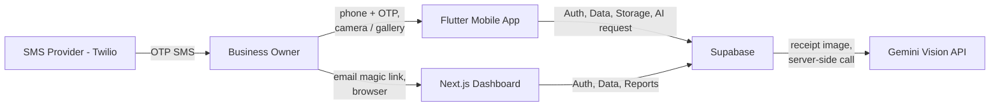
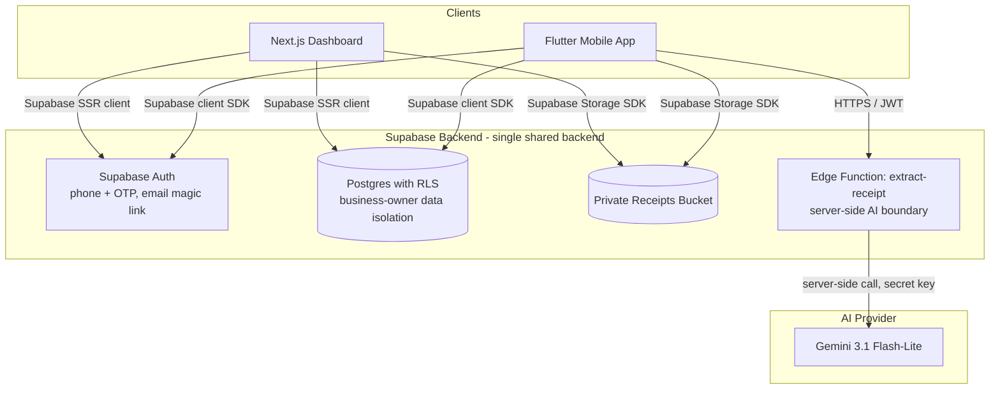
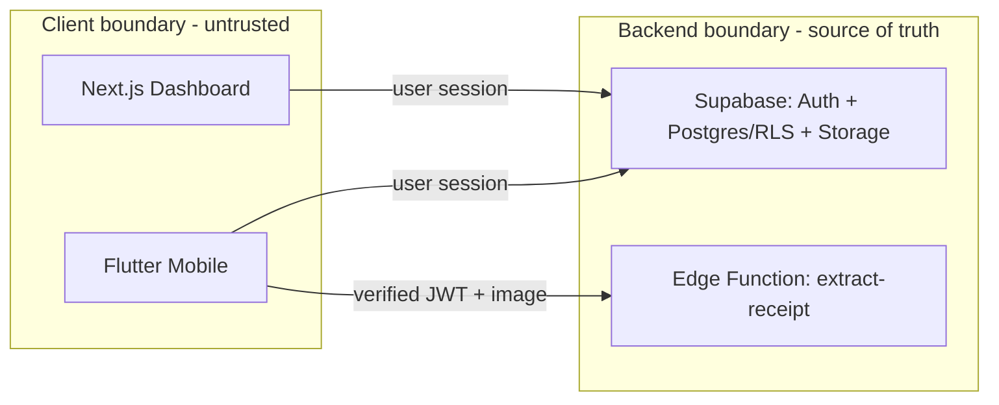
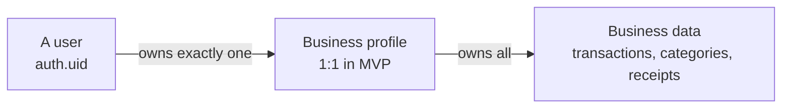
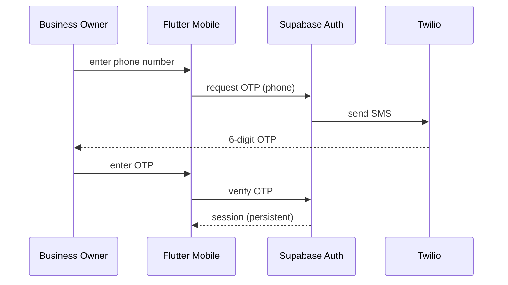
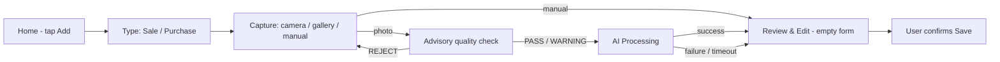
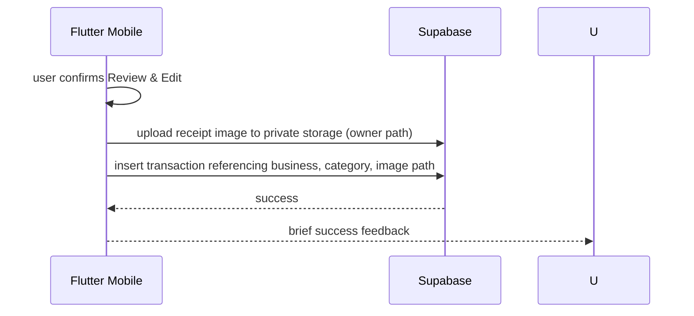
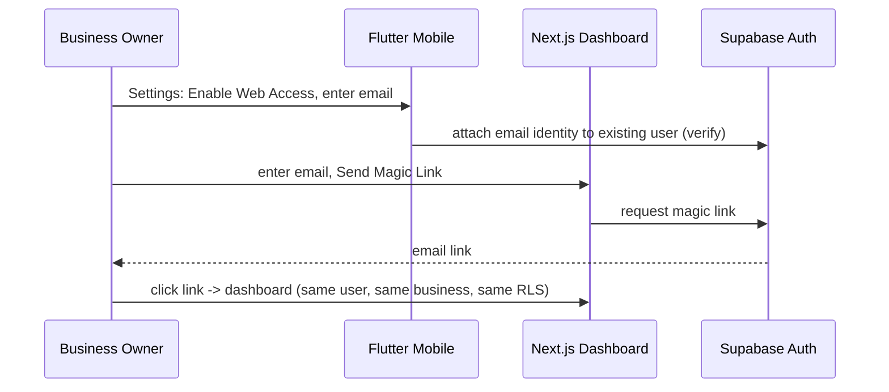
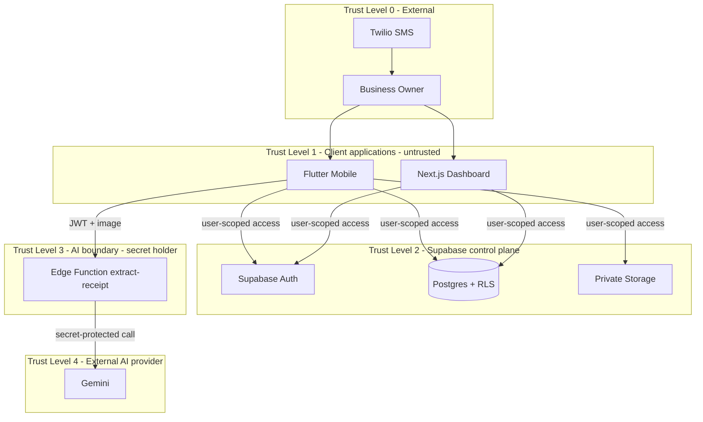

# System Architecture

## 1. Purpose

This document defines the system-level architecture of the **Smart Invoice Assistant** — an AI-powered receipt/invoice capture and bookkeeping application for small shop owners in Egypt.

It is the top-level architecture document. It establishes:

- the system context and the components that make up the system;
- the responsibilities of each component;
- the security, trust, and failure boundaries between components;
- the client/backend and ownership model;
- the end-to-end communication flows (authentication, capture, AI extraction, confirmation, persistence, reporting, export, web access);
- the boundary of what is built for the MVP and how the architecture extends for Phase 2 / Phase 3.

Companion documents provide the per-component detail:

| Document | Covers |
|---|---|
| `mobile-architecture.md` | Flutter mobile app |
| `dashboard-architecture.md` | Next.js web dashboard |
| `backend-architecture.md` | Supabase backend (auth, database, storage, server-side processing) |
| `ai-architecture.md` | Gemini-based AI extraction |
| `decisions/` | Architecture Decision Records (ADRs) |

This document is derived exclusively from the finalized requirements package (`docs/requirements/`), which includes the resolved product decisions Q-001 through Q-022. It must be read alongside those documents.

## 2. Architecture Goals

The architecture must deliver the product within the MVP scope while preserving the approved technology direction (Flutter, Next.js, Supabase, Gemini). The goals are:

1. **Simple and MVP-first** — no microservices, event buses, queues, caching layers, or other enterprise infrastructure unless explicitly required by the finalized requirements.
2. **Secure by default** — business-owner data isolation is enforced at the data layer (Row Level Security), receipt images live in a private bucket, and the Gemini secret never leaves the server-side AI boundary.
3. **Data trust** — AI-extracted data is never persisted without explicit user confirmation.
4. **Mobile-first** — the mobile app is the primary experience; the web dashboard is a companion view.
5. **Consistent across platforms** — the two clients share one schema, one report-period model, one category model, one currency (EGP), and one ownership model.
6. **Maintainable and testable** — bounded layers, feature modules, and repository abstractions so business logic can be unit-tested independently of UI and infrastructure.
7. **Scalable for reasonable future growth** — the design leaves extension points (seams) for documented Phase 2 / Phase 3 features without building them.
8. **Low-end device friendly** — the mobile app remains lightweight (avoid heavy animation, avoid heavy libraries at load time) per NFR-LOWDEV-001 and ASM-008.

## 3. System Context

The system serves one primary actor: the **business owner** (solo shop owner). A secondary future actor is the **accountant** (Phase 2 multi-user sharing, documented but out of MVP — ASM-006).

Context:

- **Flutter Mobile App** — primary product experience: authentication (phone + OTP), receipt capture, AI-assisted extraction, review & edit, manual entry, transaction management, reports, exports, and settings. (ASM-001)
- **Next.js Dashboard** — companion web view: magic-link login, overview, transactions (read/edit/delete), reports, export download, categories, and settings. It does **not** create transactions in MVP (Q-005, Q-017).
- **Supabase** — the single shared backend: Authentication, Postgres database with Row Level Security, private object Storage, and a server-side Edge Function for AI processing.
- **Gemini Vision API** — AI provider used only through the server-side AI boundary (Q-007); receipt extraction model **Gemini 3.1 Flash-Lite**.
- **Twilio** — SMS provider for OTP delivery via Supabase Phone Auth (Q-002).

## 4. High-Level Architecture

Key principles of the high-level architecture:

- **One backend, two clients.** Both clients integrate with Supabase using its client/SSR SDKs. There is no separate application backend for business data (ASM-007). The only custom server-side code is the AI Edge Function (ADR-002).
- **The data layer owns authorization.** Both clients request data with the user's own authenticated context; Supabase RLS decides what each user may read/write (NFR-SEC-001). Hiding buttons/UI is never treated as a security control.
- **The AI boundary is server-side only.** Mobile never calls Gemini directly and never holds the Gemini API key (Q-007, BR-AI-005).
- **Nothing persists before user confirmation.** AI results exist only in the client's short-lived state and the server response; a transaction (including the linked receipt image) is written only after the user confirms the Review & Edit screen (NFR-DATA-001, BR-AI-001, BR-CONFIRM-001).

## 5. Major Components

### 5.1 Flutter Mobile

The primary client. Implements authentication (phone + OTP), onboarding, the Add Transaction flow (sale/purchase → capture → AI → review & edit → confirm), transaction management, reports, exports, and settings. See `mobile-architecture.md`.

### 5.2 Next.js Dashboard

The companion web client. Implements magic-link login, an overview with summary cards, a sortable/paginated transactions data table with edit/delete, reports with export download, category management, and settings. It cannot create transactions and has no self-signup in MVP. See `dashboard-architecture.md`.

### 5.3 Supabase Auth

Identity provider for both platforms:

- Mobile: phone sign-up/login with OTP; persistent session until explicit logout (Q-003, FR-AUTH-001, FR-AUTH-006). SMS delivered through Twilio (Q-002).
- Web: email magic-link login; the linked email is an identity **on the same Supabase user** created on mobile (Q-004, Q-016). No independent web account.

### 5.4 Supabase Database

Postgres database with:

- one user ↔ one business profile (owner) in MVP (ASM-002, ASM-003);
- business-scoped tables (transactions, categories, exports metadata if any) keyed to the owner;
- **Row Level Security** enforcing owner-only access (NFR-SEC-001);
- shared category state across mobile and web (Q-021);
- default categories seeded per business, hideable but not deletable (Q-010).

Conceptual only — see `backend-architecture.md` and the later Database Design phase.

### 5.5 Supabase Storage

Private object storage for receipt images (NFR-SEC-002). Objects are owned and accessed only by the owning business (authenticated access + ownership policies). Images are uploaded only when the user confirms a transaction.

### 5.6 AI Processing Layer

A server-side Edge Function (`extract-receipt`) that:

- authenticates the caller (verified JWT);
- validates business ownership;
- forwards the receipt image to Gemini with a structured output schema;
- evaluates field and overall confidence; and
- returns a structured, non-persisted extraction result to the client.

This is the **only** component that holds the Gemini API key (Q-007). See `ai-architecture.md` and ADR-004.

### 5.7 Gemini

Google's Gemini Vision API, using **Gemini 3.1 Flash-Lite** as the initial production model for receipt/invoice extraction (Q-007). It performs image understanding and structured field extraction. It is called only by the AI Processing Layer.

## 6. Component Responsibilities

| Component | Authenticates | Authenticates/authorizes data | Persists | Executes business logic | Holds AI secret | Generates reports/exports |
|---|---|---|---|---|---|---|
| Flutter Mobile | UI + flow | Asks via user session | Writes transactions (after confirm), edits, deletes (requests) | Client-side validation/UX, review state | No | Yes (client-side, from RLS-scoped data) |
| Next.js Dashboard | UI + flow (magic link) | Asks via user session | Edits, deletes (requests) | Client-side validation/UX | No | Yes (client-side, from RLS-scoped data) |
| Supabase Auth | Yes (identity) | — | — | — | No | — |
| Supabase Database | — | Yes (RLS — the authorization authority) | Yes (owner-scoped rows) | Constraints, seed logic (conceptual) | No | Data access |
| Supabase Storage | — | Yes (auth + ownership policies) | Yes (private objects) | — | No | — |
| AI Processing Layer | Validates caller JWT | Validates caller ownership | No (never persists) | Extraction orchestration, confidence model | Yes | No |
| Gemini | (provider-side) | — | No | Image understanding / structured extraction | — | No |

## 7. Client / Backend Boundaries

The boundary between clients and backend is the **Supabase HTTPS API** plus the **server-side AI Edge Function**.

Rules of the boundary:

1. **Clients are untrusted.** All authorization decisions are re-enforced at Supabase (RLS, Storage policies). UI-level hiding is not a control.
2. **All business-data reads/writes go through Supabase with the user's authenticated identity.** RLS narrows every query to the caller's business.
3. **AI calls never bypass the server.** The client cannot call Gemini directly (no key, no endpoint).
4. **AI output is ephemeral.** The AI boundary returns extraction results; it never writes transactions or business data.
5. **Persistence only on confirmation.** Transaction creation and image upload happen together, only after the user confirms.

The full responsibility matrix is in `backend-architecture.md` (§3).

## 8. Data Ownership Model

The ownership model is a strict three-level chain:

- **User** — the authenticated Supabase identity. On mobile this is a phone-based identity; if web access is enabled, an email identity is attached to the **same** user (Q-016).
- **Business** — exactly one business profile per user in the MVP (ASM-002, ASM-003). Created during one-time onboarding (FR-ONBOARD-001/005, BR-BUS-001).
- **Business data** — categories, transactions, and receipt images. Every row/object carries its owning business. RLS and Storage policies derive ownership from `auth.uid()` → business, so each owner can only ever query/write their own data (NFR-SEC-001, BR-SEC-001).

Implications:

- Multi-user access (owner + employee) is Phase 2: the model is laid out so a future membership table can extend `auth.uid() → business` to `members → business` without changing the data-ownership concept. This is an extension point, not an MVP feature (FR §4.2).
- Deleting an account removes the business and all owned data (FR-SETTINGS-006).

## 9. Communication Flows

### 9.1 Authentication

- Mobile only; no email/password in MVP (FR-AUTH-002, BR-AUTH-001).
- Wrong OTP → inline error, resend after 60-second cooldown (FR-AUTH-004/005, Q-001).
- Session persists until explicit logout; no inactivity timeout (FR-AUTH-006, Q-003).
- After first login the app enforces one-time Business Setup before Home (FR-ONBOARD-001…005).
- See `mobile-architecture.md` (§5.1, §11) and ADR-003.

### 9.2 Business Onboarding

1. First successful login → splash/session router shows Business Setup.
2. User enters business name and selects business type (Retail / Restaurant / Pharmacy / Service / Other) (FR-ONBOARD-002/003).
3. Default currency set to EGP (FR-ONBOARD-004, Q-012).
4. Confirm → business profile created (FR-ONBOARD-005) and default categories seeded (Q-010).
5. App routes to Home Dashboard (FR-ONBOARD-005).

### 9.3 Create Transaction

- Reachable in one tap anywhere (FR-CAPTURE-001).
- Type selected: Sale/Income or Purchase/Expense (FR-CAPTURE-002).
- Image quality check is advisory: PASS / WARNING / REJECT (FR-CAPTURE-005, Q-020).
- Offline: no queueing; a clear message explains that internet access is required and allows retry (Q-018).
- Manual option skips AI entirely (FR-CAPTURE-007, BR-REC-002).

### 9.4 Receipt Processing

1. After capture and a PASS/WARNING quality result, the mobile app calls the `extract-receipt` Edge Function with the image bytes and transaction context (type, business id) in the authenticated request.
2. The Edge Function validates the caller's JWT and business ownership.
3. A clear loading state is shown; never a frozen screen (FR-AI-007, NFR-PERF-001).
4. If there is no usable result within **15 seconds**, the timeout path is shown with manual entry offered (FR-AI-008, Q-009).

### 9.5 AI Extraction

1. Edge Function sends the image to Gemini 3.1 Flash-Lite with a structured-output schema (Q-007).
2. Gemini returns structured fields: date, total amount, vendor/customer name (if present), line items (if legible), suggested category (FR-AI-002).
3. The Edge Function attaches a per-field confidence and an overall confidence (FR-AI-003).
4. Field confidence < 80% → the field is flagged for review (Q-008, BR-AI-002).
5. Required information missing **or** overall confidence < 50% → extraction failure → route to manual entry (FR-AI-006, Q-008).
6. The extraction result is returned to the client; **nothing is persisted** server-side.

Full pipeline in `ai-architecture.md`.

### 9.6 Review and Confirmation

1. The Review & Edit screen shows extracted fields pre-filled in an editable form (FR-REVIEW-001/003).
2. Low-confidence fields (<80%) are visually flagged (FR-AI-004).
3. The category picker defaults to the AI suggestion; the user may override (FR-REVIEW-004, FR-CATEGORY-002).
4. The original photo thumbnail is shown, tappable for full size (FR-REVIEW-005).
5. The user must confirm before anything is written (FR-REVIEW-002, NFR-DATA-001).

### 9.7 Persist Transaction

- Persistence happens only on confirmation (BR-CONFIRM-001).
- The image is stored privately and linked to the record (FR-REVIEW-006, NFR-SEC-002).
- DB and Storage writes are treated as one logical commit: if either fails, the client surfaces an error and the user can retry; no partial record is presented as saved (see `backend-architecture.md` §14).
- Manual (no receipt) transactions persist without an image.

### 9.8 Transaction Management

- List: chronological, most recent first, grouped by date (FR-TRANS-001/002); rows show thumbnail, vendor/customer, category, color-coded amount, date (FR-TRANS-003).
- Filters: date range, category, type, amount range (FR-TRANS-004…007).
- Search: vendor/customer name only (FR-TRANS-008, Q-022).
- Detail: read-only by default with original image (FR-TRANS-009/010); Edit reopens the form pre-filled (FR-TRANS-011); Delete requires confirmation and removes record + image (FR-TRANS-012/013).
- Concurrency: Last Write Wins (Q-006).
- Web mirrors these as read/edit/delete (no create) (Q-017).

### 9.9 Reports

- Unified period selector on both platforms: This Week / This Month / Last Month / Year-to-Date / Custom Range (FR-DASH-004, FR-WEB-REPORT-001, Q-011).
- Summary cards (income, expenses, net) for the period (FR-DASH-001/005, FR-WEB-DASH-002).
- Category breakdown sorted by highest spend (FR-DASH-006, BR-REPORT-001).
- Comparison vs the previous period (FR-DASH-007, FR-WEB-DASH-005).
- Reports are computed from RLS-scoped aggregate queries; no cached reporting layer in MVP.

### 9.10 Export

- Formats: PDF (human-readable, accountant-ready) and Excel/CSV (raw data) (FR-EXPORT-001…003, Q-013).
- Scope = selected period **and** current filters; a filtered subset exports exactly that subset (FR-EXPORT-001, Q-014).
- PDF content: report period, total income, total expenses, net, category breakdown, transaction list (Q-013).
- Excel: three sheets — Summary, Transactions, Categories (Q-013).
- CSV: flat transaction-level data (Q-013).
- Amounts formatted as EGP (e.g. `1,250.50 ج.م`); exported numeric data remains machine-readable (Q-012, BR-EXPORT-003).
- Mobile: file generated then shared via share sheet (FR-EXPORT-004). Web: direct download (FR-WEB-REPORT-003).
- Generation is done client-side from the RLS-scoped dataset already in the client; server-side generation is a Phase 2 extension point for very large datasets.

### 9.11 Web Dashboard Access

- Email identity links onto the existing phone user; no second account (FR-SETTINGS-003, Q-016).
- No web self-signup; unlinked email is blocked with a message (FR-WEB-AUTH-002, BR-WEB-001/003).
- Expired/used magic link → "Link expired" + "Send new link" (FR-WEB-AUTH-004).
- Unlink from mobile or web → existing web access rejected on its next request; user is returned to the login/disabled state and told to re-enable from mobile (Q-015, BR-WEB-006).
- Web session persists until explicit logout (FR-WEB-AUTH-003).
- Full detail in ADR-006.

## 10. Security Boundaries

Boundaries:

1. **Identity boundary** — Supabase Auth issues and verifies sessions for both clients. Clients never mint their own identity.
2. **Authorization boundary** — Row Level Security on every business-scoped table and ownership policies on Storage objects. This is the authoritative data-access check for both clients (NFR-SEC-001, BR-SEC-001).
3. **AI secret boundary** — the Gemini API key exists only inside the Edge Function runtime; it is never embedded in either client or passed to them (Q-007, BR-AI-005).
4. **Private storage boundary** — receipt images live in a private bucket with authenticated, owner-scoped access only (NFR-SEC-002, BR-SEC-002).
5. **Confirmation boundary** — AI output cannot cross into persistence except through explicit user confirmation (NFR-DATA-001).

## 11. Trust Boundaries

- **Clients are NOT trusted.** Nothing in the architecture relies on the client behaving correctly; RLS, Storage policies, and the Edge Function's own JWT + ownership validation are the enforcement points (see ADR-002).
- **Supabase Postgres is the single source of truth.** All client-visible data is governed by RLS; no client can bypass it through the normal SDK paths.
- **The AI boundary validates the caller before spending AI calls.** The Edge Function rejects unauthenticated or cross-owner requests.
- **Gemini is a provider at the edge of trust.** Only the AI boundary can reach it; its output is treated as untrusted data that must be validated and confirmed before persistence.
- **Twilio** delivers OTP messages via Supabase Phone Auth; the app does not integrate with Twilio directly.

## 12. Failure Boundaries

| Failure | Behavior | Source |
|---|---|---|
| No network during capture | No offline queueing; clear message that internet is required; retry allowed | Q-018, BR-MVP-004 |
| AI extraction failure (missing required info or overall confidence < 50%) | Route to manual entry; never a hard error | FR-AI-005/006, Q-008 |
| AI timeout (> 15s, no usable result) | Timeout message + "Enter manually instead" | FR-AI-008, Q-009 |
| Non-receipt image (empty/near-empty result) | "Couldn't read this as a receipt, try again or enter manually" | FR-AI-009 |
| OTP not received / wrong OTP | Inline error; resend after 60s cooldown; support link | FR-AUTH-004/005, Q-001 |
| Magic link expired/used | "Link expired" + "Send new link" | FR-WEB-AUTH-004 |
| Email not linked to a business | Web login blocked with explanatory message; no signup | FR-WEB-AUTH-002 |
| Save fails (record or image) | Error state surfaced to the user; user can retry; no partial "saved" state | requirements §7 |
| Delete fails mid-way | Confirmation-first; delete removes record + image as a unit; failure surfaced | FR-TRANS-013 |
| Web access unlinked while session active | Next authenticated request is rejected; user returned to disabled state | Q-015, BR-WEB-006 |
| Concurrent edit web↔mobile | Last Write Wins; no conflict UI in MVP | Q-006 |
| Accidental delete | Confirmation dialog is the only safeguard; no undo/trash in MVP | BR-TRANS-004 |

Each failure is contained at its own boundary (client UX, server response, or storage), so a failure in one step never blocks the user from an alternative (manual entry) or a retry.

## 13. Performance Considerations

- **Extraction latency:** target "a few seconds" for extraction (NFR-PERF-001); the client compresses/downscales the image before sending to reduce upload and Gemini latency while keeping the receipt legible; a 15-second client-visible ceiling bounds worst case (Q-009).
- **Lightweight mobile app:** heavy operations (PDF generation, large images) are done on demand; the UI avoids heavy animations; libraries are chosen with low-spec Android in mind (NFR-LOWDEV-001, ASM-008).
- **Report queries:** aggregates run over the owner's rows scoped by RLS with indexes on the owner + date filter; data volumes for a solo shop are small, so no caching/OLAP layer is warranted in MVP.
- **Web data table:** paginated (FR-WEB-TRANS-001); initial dashboard page limits recent transactions (FR-WEB-DASH-004).
- **Single-pass image handling:** the captured image is processed once for quality, sent once for AI, and uploaded once on confirmation — no repeated full-size copies on the client.

## 14. MVP Architecture Boundaries

In scope for the MVP build:

- Phone + OTP authentication with persistent session; business onboarding; EGP-only.
- Mobile capture flow (camera/gallery/manual) with advisory quality check.
- Server-side AI extraction (Edge Function → Gemini 3.1 Flash-Lite) with confidence model and manual fallback.
- Review & Edit with mandatory confirmation before persistence.
- Categories (10 defaults seeded per business, hidden not deleted, custom categories, shared across platforms, normalized uniqueness).
- Transactions (list/filter/search/view/edit/delete) on mobile; read/edit/delete on web.
- Reports with unified period selectors and category breakdown/comparison.
- Exports (PDF, Excel, CSV) scoped to period + filters.
- Settings (business profile, categories, web access enable/link, language, logout, delete account).
- Web dashboard companion with magic-link login and no create/self-signup.

Explicitly out of the MVP architecture (documented, not built):

- Offline capture/queueing/sync (Q-018) — network required during capture.
- Web transaction creation (Q-005, Q-017).
- Multi-user/multi-branch (Phase 2/3).
- ETA e-invoice/e-receipt integration (Phase 2).
- Duplicate-receipt hash detection (POST-MVP).
- Real-time sync / conflict resolution (POST-MVP; MVP is last-write-wins).
- Push notifications, recurring templates, low-stock, WhatsApp submission, plain-language summaries, loan tracking.
- Multi-currency, double-entry accounting, payroll, direct government filing (out of scope).

## 15. Post-MVP Extensibility

The architecture is shaped so the documented Phase 2 / Phase 3 items slot in without a rewrite:

| Future capability | Extension point in this architecture |
|---|---|
| ETA e-invoice/e-receipt integration | Export layer already produces structured data; a future mapping/export adapter (period-scoped) can target ETA formats; no core change |
| Multi-user access per business | Ownership model (user → business → data) extends to membership linking many users to one business; RLS concept generalizes to "member of the business" |
| Offline capture + sync | A future local-first queue in the mobile data layer would feed the same AI boundary and the same persistence path on reconnect |
| Duplicate-receipt hash check | Storage upload path can compute and record an image hash at confirm time without changing flow |
| Real-time sync / conflict handling | Edge Function + Supabase Realtime can layer on top of the existing RLS-scoped reads; MVP intentionally omits (Q-006) |
| Push notifications | New scheduled/cron Edge Functions over the existing RLS-scoped data |
| WhatsApp receipt submission | A new ingestion Edge Function feeding the same extraction pipeline and confirmation flow is a separate future surface (does not alter mobile path) |
| Plain-language AI summary | The AI boundary (Edge Function) is the natural host; it already owns Gemini access |
| Larger export volumes / account reconciliation | Server-side export Edge Function can replace client-side generation without changing data model |
| Model/provider change | Gemini is isolated behind the AI boundary's stable interface (ADR-004) |

No speculative component is built now; these are seams, not scaffolding.

## 16. Architecture Risks

| Risk | Impact | Mitigation |
|---|---|---|
| Gemini OCR/extraction quality on Arabic/written receipts varies | Low-confidence results, manual re-entry, user frustration | Confidence model (<80% flag, <50% failure) + always-available manual entry; provider isolated for model tuning; NFR-PERF-001 target monitored |
| SMS delivery reliability/cost in Egypt (Twilio) | OTP friction; users blocked at login | Supabase Phone Auth + Twilio per Q-002; resend + support path; monitor delivery success in Phase 2 |
| Low-spec device memory/CPU during capture+AI | Jank, ANRs, or app kills | Client-side compression before upload; on-demand heavy work; lightweight libraries (NFR-LOWDEV-001) |
| Last-write-wins data loss on concurrent edit | Silent overwrite of a user's edit | Accepted MVP decision (Q-006); documented; Phase 2 real-time sync considered if validated |
| RLS misconfiguration becoming an access leak | Cross-business data exposure | RLS is the primary security control; Database Design phase must add policy tests; advisors/audit in CI |
| Private storage misconfiguration (bucket made public) | Receipt image exposure | Bucket created private by default; policies owner-scoped; tested in security phase |
| Gemini API key leakage | Cost abuse / data exfiltration via the model | Key stored only in Edge Function env/secrets; verify_jwt on; never shipped in clients (Q-007, BR-AI-005) |
| Eliminating manual entry reachability on failure paths | Users trapped in a dead end | Every AI failure/timeout path must offer manual entry (FR-AI-005/008, AC-AI-004/006) |
| Scope creep of Phase 2/3 concepts into MVP | Complexity, delay, heavier app | Section 14 boundaries enforced during design phases; ADRs record decisions |

## 17. Traceability to Requirements

| Architecture element | Requirement / decision IDs |
|---|---|
| Phone + OTP auth, persistent session | FR-AUTH-001…007, BR-AUTH-001…004, NFR-SEC-001, Q-001, Q-002, Q-003 |
| Business onboarding (name, type, EGP) | FR-ONBOARD-001…005, BR-BUS-001…003, Q-012 |
| Capture flow + advisory quality check | FR-CAPTURE-001…007, BR-REC-001/002/005, Q-018, Q-020 |
| Server-side AI boundary | FR-AI-001, BR-AI-005, Q-007, ADR-004 |
| Confidence model & failure routing | FR-AI-003…006, FR-AI-008, FR-AI-009, BR-AI-002/003, Q-008, Q-009 |
| Review & confirmation gate | FR-REVIEW-001…007, BR-CONFIRM-001, NFR-DATA-001 |
| Categories (defaults, custom, shared) | FR-CATEGORY-001…005, BR-CATEGORY-001…008, Q-010, Q-021 |
| Transactions (list/filter/search/manage) | FR-TRANS-001…013, BR-TRANS-001…007, Q-006, Q-022 |
| Reports (unified periods, summaries) | FR-DASH-001…007, BR-REPORT-001…004, Q-011, Q-012 |
| Export (PDF/Excel/CSV, scope) | FR-EXPORT-001…004, BR-EXPORT-001…003, Q-012, Q-013, Q-014 |
| Settings & profile | FR-SETTINGS-001…006 |
| Web auth & access model | FR-WEB-AUTH-001…004, BR-WEB-001…006, Q-004, Q-015, Q-016 |
| Web dashboard features | FR-WEB-DASH-001…006, FR-WEB-TRANS-001…006, FR-WEB-REPORT-001…003, FR-WEB-CATEGORY-001…003, FR-WEB-SETTINGS-001…003, Q-005, Q-017, Q-019 |
| RLS / private storage / no silent save | NFR-SEC-001, NFR-SEC-002, NFR-DATA-001, BR-SEC-001/002 |
| RTL Arabic-first, low-end device, performance | NFR-LANG-001, NFR-LOWDEV-001, NFR-PERF-001, ASM-008, ASM-015 |
| MVP boundaries (offline OUT, web create OUT, etc.) | BR-MVP-001…006, Q-005, Q-017, Q-018 |