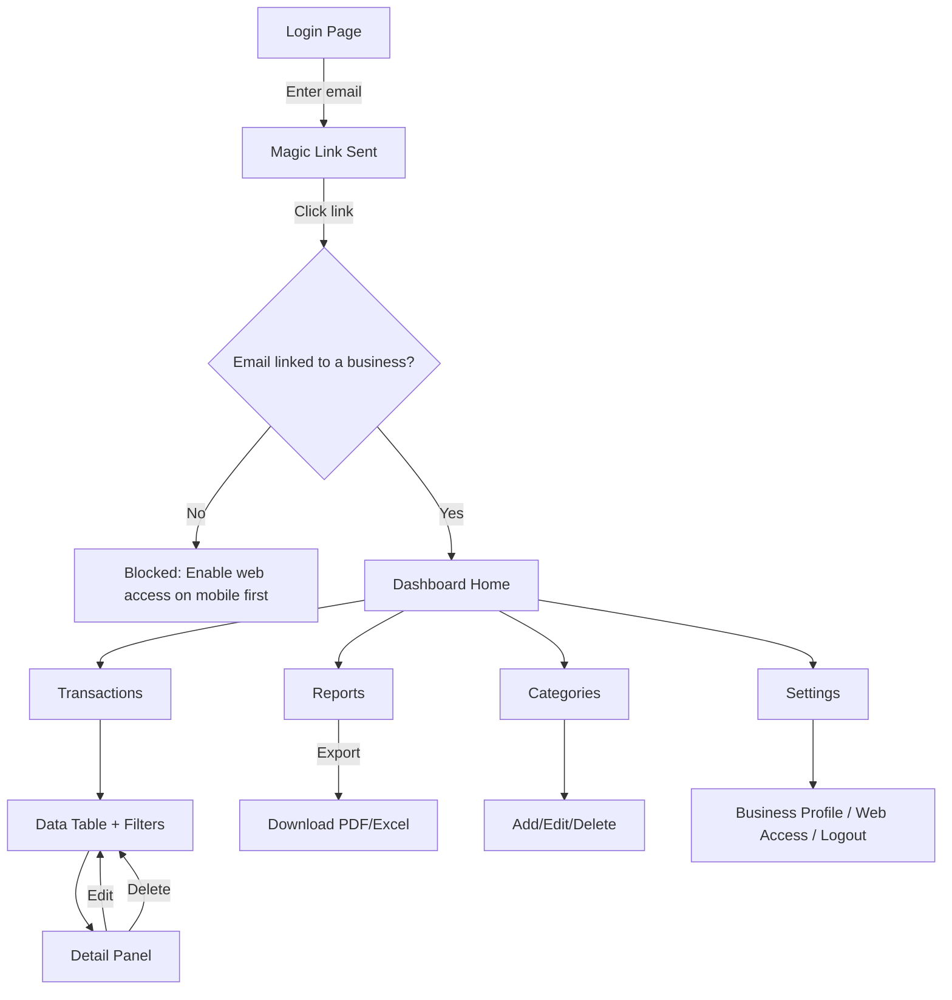

# User Flow — Web Dashboard (Next.js)

**Scope**: This document covers the **web dashboard only** (Next.js + Supabase, same database as the mobile app). For the mobile app, see `user-flow-mobile.md`. Companion to `feature-list.md`.

**Assumption (please confirm before development)**: At MVP, the dashboard is a **companion view** to the mobile app, not a replacement — it is mainly for reviewing data on a bigger screen, running reports, and light management. Receipt capture (camera + AI extraction) stays mobile-only for MVP. The dashboard reads/writes the same Supabase tables as the mobile app, so no separate backend is needed.

**Open design decision — Web login method**: The mobile app uses phone + OTP. Web dashboards are typically used with email/password or magic links instead. Proposed approach: business owner enables web access from the mobile app (Settings → "Enable Web Access", see `user-flow-mobile.md` section 5), which links an email identity to their existing Supabase user. If you'd prefer a different approach (e.g., a separate invite-only web login), flag it before this flow is finalized.

---

## 1. Login Flow (Web)

1. **Landing/Login Page** → email input field → "Send Magic Link" button.
2. User receives email → clicks link → redirected back to the dashboard, authenticated via Supabase.
3. If the email isn't linked to any business account yet → show a clear message: "This email isn't linked to a business account. Enable web access from the mobile app first." (no self-signup on web for MVP — the mobile app is the source of truth for account creation).
4. On successful login → redirect to **Dashboard Home**.
5. Session persists (stay logged in) until explicit logout.

---

## 2. Dashboard Home (Overview)

1. Landing screen after login.
2. **Summary cards**: Total Income, Total Expenses, Net — for the current month by default.
3. **Category breakdown** (chart, e.g. Tremor bar/donut chart) — same underlying data as the mobile Reports tab.
4. **Recent transactions** — last 10 entries, each linking to full detail.
5. **Period comparison** vs previous month (e.g., "+15% expenses vs last month").
6. Top navigation: Overview / Transactions / Reports / Categories / Settings.

---

## 3. Transactions Management

1. From top nav → **Transactions**.
2. **Data table** (sortable columns, paginated): date, type (income/expense), vendor/customer, category, amount, receipt thumbnail.
3. **Filter bar**: date range, category, type, amount range — mirrors the mobile app's filters so behavior is consistent across platforms.
4. **Search** by vendor/customer name.
5. Click a row → **Detail panel** (side drawer or modal):
   - All fields, read-only by default.
   - Full-size receipt image viewer.
   - "Edit" button → inline editable form → Save updates the same Supabase record the mobile app reads.
   - "Delete" button → confirmation dialog.
6. *(Optional, not required for MVP)*: "Add Transaction" button for manual desktop entry without a photo — useful for an accountant reconciling records, but can be deferred to Phase 2.

---

## 4. Reports Flow

1. From top nav → **Reports**.
2. Period selector: This Month / Last Month / Custom Range / Year-to-date.
3. Summary cards + category breakdown (same data model as mobile, richer chart on the larger screen).
4. **Export** button → choose PDF or Excel/CSV → downloads directly (no share sheet needed on web, just a file download).
5. This screen is the one most likely to be used by an accountant the business owner shares access with in the future (Phase 2 multi-user).

---

## 5. Categories Management

1. From top nav → **Categories**.
2. Table of all categories (default + custom), with usage count (how many transactions use each).
3. Add/edit/delete custom categories — mirrors mobile Settings, same underlying table.
4. Default categories can be hidden but not deleted (same rule as mobile).

---

## 6. Settings

1. From top nav → **Settings**.
2. **Business Profile**: name, type — editable, syncs with mobile.
3. **Web Access**: view/unlink the email identity connected to this account.
4. **Logout**.

---

## Edge Cases & Error States to Handle

| Situation | Expected behavior |
|---|---|
| Email not yet linked to a business (no "Enable Web Access" done on mobile) | Block login with a clear explanatory message, no dashboard signup flow in MVP. |
| Magic link expired or already used | Show "Link expired" with a "Send new link" button. |
| New business with zero transactions | Empty state on Home/Transactions/Reports with a short message ("Add your first transaction from the mobile app") rather than a blank/broken-looking screen. |
| User edits a transaction on web while mobile app is open on the same record | Not handled specially in MVP (last write wins) — flag as a Phase 2 real-time sync consideration if it becomes a real problem. |
| Web access unlinked while user is logged in elsewhere | Session should be invalidated on next request (Supabase handles this by default via RLS + auth checks). |

---

## Simplified Flow Diagram

