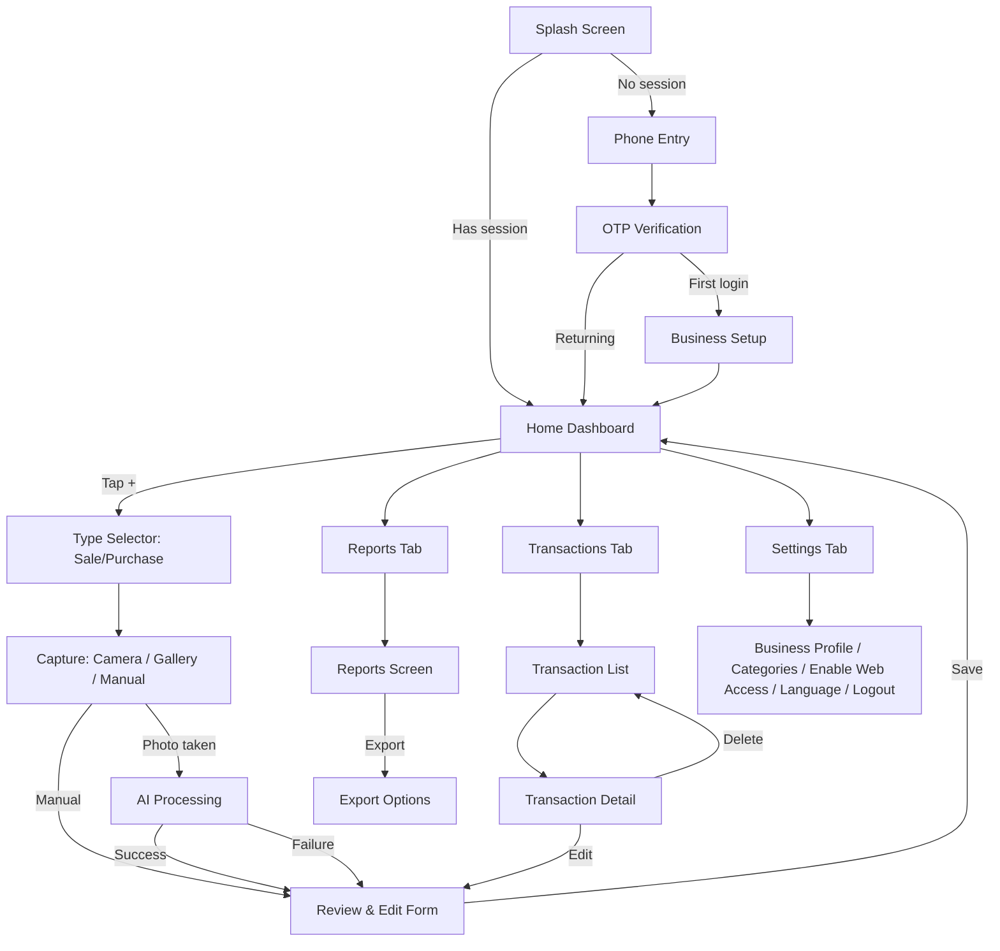

All kinds of work—writing, design, content planning, architecture—anything where you want to think things through properly before diving in. I've been running Superpowers for weeks now, and here's my honest reflection: investing in the brainstorming phase, the scoping and planning pays off tenfold. The plans that come out are 10x better, and in my experience, Claude one-shots everything I throw at it as long as you invest the time in the planning. It just feels like a major level up. 

Let me show you everything it does, including the new visual brainstorming feature that honestly blew my mind. Let's go! It's happening. The founders are on the globe right now, and most don't find out why until it's too late. 

Let's get this installed first so you can follow along. Superpowers is in the official Anthropic marketplace, which is already registered when you install Code Code, so you don't need to add a marketplace first. Just type /plugin. And that's it! Superpowers is now active in every Cloud Code session. You can verify it by heading over to the install tab, and you'll see Superpowers with all the fourteen skills and the three key commands listed here: brainstorm, write plan, and execute plan. 

Now let's look at what those skills actually do. Superpowers is built around these three commands: brainstorm, write plan, and execute plan. But I feel it's useful to talk about the core workflow as these seven phases. 

First, we have brainstorming. Claude doesn't jump to code; it explores the project context first, then asks you questions one at a time. It presents the design in digestible sections, getting your approval after each one. And if the topic involves anything visual—layouts, components, diagrams—it offers to spin up a browser-based companion. More on that in a minute. 

In the second phase, we have Git worktree isolation. Before touching any code, Superpowers can create an isolated Git worktree. Your main branch stays clean. If the implementation goes sideways, you just delete the worktree. 

In phase three, work into granular tasks with a full implementation plan: file inventories, verification commands, success criteria, and rollback procedures. The plan is written so clearly that, and this is an actual quote from the README file, an enthusiastic junior engineer with poor taste, no judgment, no project context, and an aversion to testing could follow it. 

Then we have subagent-driven development. Superpowers gives you two options here. You can dispatch tasks to subagents within your current session—multiple agents working in parallel—or you can take the plan to a fresh session and execute it there, which is great for larger implementations where you want a clean context. Either way, each task gets implemented independently.# User Flow — Mobile App (Flutter)

**Scope**: This document covers the **Flutter mobile app only**. For the web dashboard, see `user-flow-dashboard.md`. Companion to `feature-list.md`.

---

## 1. Onboarding Flow (first-time user)

1. **Splash Screen** → checks if user has an active Supabase session.
   - If yes → go straight to Home Dashboard (step 2.1).
   - If no → go to Phone Entry.
2. **Phone Entry Screen** → user enters phone number → tap "Send Code".
3. **OTP Verification Screen** → user enters 6-digit code → verified via Supabase Phone Auth.
   - Error state: wrong code → inline error, allow resend after cooldown.
4. **Business Setup Screen** (one-time, only after first successful login)
   - Business name (text input)
   - Business type (dropdown: Retail / Restaurant / Pharmacy / Service / Other)
   - Confirm button → creates the business profile record → navigates to Home Dashboard.

---

## 2. Core Loop: Add New Transaction

This is the most-used flow in the app and should be reachable in **one tap** from anywhere (floating action button on Home).

1. **Home Dashboard** → tap "+" (Add Transaction) button.
2. **Type Selector** → user picks: "Sale / Income" or "Purchase / Expense".
3. **Capture Screen**
   - Option A: Open camera → take photo of receipt.
   - Option B: Pick existing photo from gallery.
   - Option C: "Skip — enter manually" (bypasses AI entirely, goes to step 6 with empty form).
4. **Processing State** (after photo captured)
   - Loading indicator while image uploads and Gemini API extracts data.
   - Timeout/error handling: if extraction fails or takes too long → show message + button "Enter manually instead" (never a dead end).
5. **Review & Edit Screen**
   - Pre-filled form with extracted fields: date, amount, vendor/customer, category, (line items if available).
   - Low-confidence fields visually flagged (e.g., subtle highlight) prompting the user to double-check.
   - User can edit any field.
   - Thumbnail of the original photo shown, tappable to view full-size.
   - Category can be changed via a picker (defaults to AI suggestion).
6. **Confirm & Save**
   - Tap "Save" → record written to Supabase → photo stored in Storage bucket, linked to the record.
   - Success feedback (brief toast/snackbar) → return to Home Dashboard, which now reflects updated totals.

---

## 3. Browse & Manage Transactions

1. **Home Dashboard** → tap "Transactions" tab (bottom navigation).
2. **Transaction List Screen**
   - Chronological list, most recent first, grouped by date.
   - Each row: thumbnail, vendor/customer name, category, amount (color-coded income/expense), date.
   - Top of screen: filter bar (date range, category, type) + search field.
3. Tap a transaction → **Transaction Detail Screen**
   - All fields shown read-only by default.
   - "Edit" button → reopens the Review & Edit form (same as step 2.5 above) pre-filled with saved values.
   - "Delete" button → confirmation dialog → removes record and associated image.

---

## 4. Reports Flow

1. **Home Dashboard** → tap "Reports" tab (bottom navigation).
2. **Reports Screen**
   - Period selector: This Week / This Month / Custom Range.
   - Summary cards: Total Income, Total Expenses, Net.
   - Category breakdown (list or simple bar chart), sorted by highest spend.
   - Comparison line vs previous period ("+15% vs last month").
3. Tap "Export" → **Export Options Sheet**
   - Choose format: PDF or Excel/CSV.
   - Choose period (defaults to what's currently selected).
   - Confirm → file generated → share sheet opens (WhatsApp, email, save to device, etc.).

---

## 5. Settings Flow

1. **Home Dashboard** → tap "Settings" (bottom navigation or profile icon).
2. **Settings Screen**
   - Business profile (name, type) → editable.
   - Manage Categories → list of categories, add/edit/delete custom ones (default categories cannot be deleted, only hidden).
   - **Enable Web Access** → link an email address to the account for dashboard login (see `user-flow-dashboard.md`, section 1). Optional step, not required to use the mobile app.
   - Language toggle (Arabic default / English).
   - Logout.
   - Delete account (with confirmation + explanation of data loss).

---

## Edge Cases & Error States to Handle

| Situation | Expected behavior |
|---|---|
| No internet connection during capture | Queue locally, show "will process when back online" (or, for true MVP, simply block with a clear message — decide based on Phase 1 vs Phase 2 scope). |
| AI returns low/no confidence on all fields | Treat as extraction failure → route to manual entry, don't force user to fix garbage data. |
| User captures a non-receipt image (e.g., a random photo) | Gemini should return an empty/near-empty result → show "Couldn't read this as a receipt, try again or enter manually." |
| Duplicate receipt (same photo/data submitted twice) | Not required for MVP, flag as a Phase 2 nice-to-have (simple hash check on image). |
| OTP not received | Resend button after a cooldown timer (e.g., 30s), plus a "having trouble?" support link. |
| User deletes a transaction by mistake | Confirmation dialog before delete is the only safeguard in MVP (no undo/trash in Phase 1). |

---

## Simplified Flow Diagram

